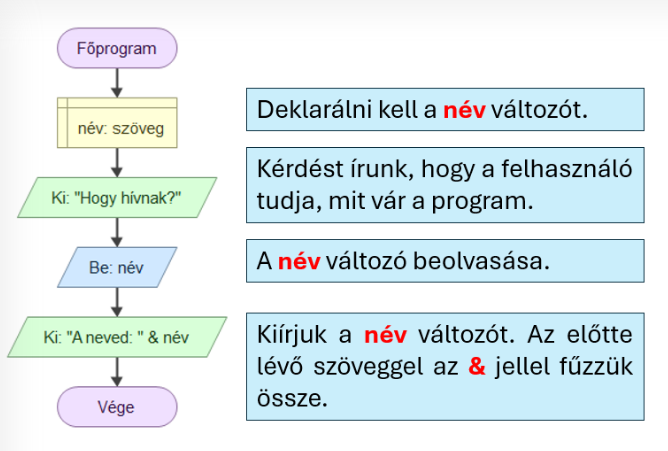
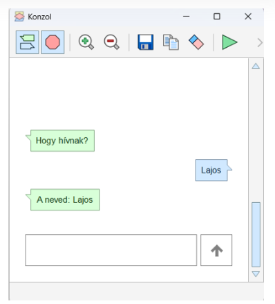

# ⌨️ Adat beolvasása és felhasználása

<div class="article-hero">
  <div>
    <span class="article-kicker">FLOWGORITHM · BEMENET</span>
    <h2>Kérj be adatot a felhasználótól!</h2>
    <p>A program kérdezhet valamit, a felhasználó válaszát pedig eltárolhatja egy változóban, majd később felhasználhatja.</p>
  </div>
  <div class="article-hero__icon">⌨️</div>
</div>

<div class="article-meta">
  <span>👀 kezdőknek</span>
  <span>⏱️ 4–6 perc</span>
  <span>⌨️ bemenet</span>
</div>

<div class="article-intro">
  <strong>Mire jó?</strong>
  <span>Ha azt szeretnéd, hogy a program ne csak előre megadott adatokkal dolgozzon, hanem a felhasználótól is kérjen valamit, a <strong>Beolvasás</strong> elemet használod.</span>
</div>

!!! tip "Kapcsolódás az előző részhez"
    A **Beolvasás** elem nem maga „emlékszik” az adatra. A felhasználó válaszát egy már létrehozott <strong>változóban</strong> tároljuk.

## Egy teljes, egyszerű példa

Ebben a programban megkérdezzük a felhasználó nevét, eltároljuk a választ a **név** változóban, majd személyre szabott üzenetet írunk ki.

<figure class="tool-figure tool-figure--wide">
  <a href="../../../images/eszkoztar/flowgorithm/flowgorithm-beolvasas-01-teljes-folyamat.png" target="_blank">
    
  </a>
  <figcaption>Egy teljes példa: <strong>deklarálás → kérdés → beolvasás → felhasználás</strong>.</figcaption>
</figure>

## 1. Először legyen egy megfelelő változó!

A beolvasott adatot valahol tárolni kell. Ha nevet szeretnél bekérni, előtte hozz létre például egy **név** nevű, **szöveg** típusú változót!

<div class="related-grid">
  <a href="../deklaralas/">
    <span class="related-icon">📦</span>
    <span class="related-text"><strong>Deklarálás (változó)</strong><small>Ha még nem biztos, hogyan hozd létre a változót.</small></span>
  </a>
</div>

## 2. Írd ki, mit vársz a felhasználótól!

A program előbb mondja meg, mit kell beírni. Például:

```text
"Hogy hívnak?"
```

Így a felhasználó tudja, milyen adatot vár a program.

## 3. Olvasd be az adatot a változóba!

Szúrj be egy **Beolvasás** elemet, és add meg annak a változónak a nevét, amelyben a választ tárolni szeretnéd!

Ebben a példában:

```text
név
```

A felhasználó által beírt adat ettől kezdve a **név** változó értéke lesz.

## 4. Használd fel a beolvasott adatot!

A változó tartalmát később kiírhatod vagy felhasználhatod más műveletben is.

Például:

```text
"A neved: " & név
```

<div class="quick-note">
  <strong>Mit jelent az &amp; jel?</strong>
  <span>Az <strong>&amp;</strong> jellel szöveget és egy változó tartalmát fűzheted össze. Így az <strong>„A neved: ”</strong> szöveg után megjelenik az is, amit a felhasználó korábban beírt.</span>
</div>

## 5. Futtasd le és próbáld ki!

A futó program először felteszi a kérdést. Írd be a választ, majd figyeld meg, hogy a program felhasználja-e azt a következő kiírásban!

<figure class="tool-figure tool-figure--medium">
  <a href="../../../images/eszkoztar/flowgorithm/flowgorithm-beolvasas-02-futtatasi-pelda.png" target="_blank">
    
  </a>
  <figcaption>A program bekéri a nevet, majd felhasználja a válaszban.</figcaption>
</figure>

!!! warning "Gyakori hiba"
    A **Beolvasás** elemben annak a változónak a nevét add meg, amelybe az adatot tárolni szeretnéd. Ha a változó nem létezik, vagy nem megfelelő a típusa, a program nem fog megfelelően működni.

## Gyors ellenőrzés

<div class="check-panel">
  <label><input type="checkbox"><span>Létrehoztam a beolvasandó adathoz megfelelő változót.</span></label>
  <label><input type="checkbox"><span>Kiírtam egy kérdést vagy utasítást, hogy a felhasználó tudja, mit kell megadnia.</span></label>
  <label><input type="checkbox"><span>A <strong>Beolvasás</strong> elemben a megfelelő változót adtam meg.</span></label>
  <label><input type="checkbox"><span>Lefuttattam a programot, és kipróbáltam egy saját adattal.</span></label>
  <label><input type="checkbox"><span>A program a beolvasott adatot később helyesen felhasználta.</span></label>
</div>

!!! note "A jelölések nem mentődnek"
    A pipák csak ezen az oldalon látszanak. Az oldal bezárása után nem maradnak meg.

<div class="back-link"><a href="../">← Vissza a Flowgorithm eszköztárhoz</a></div>
