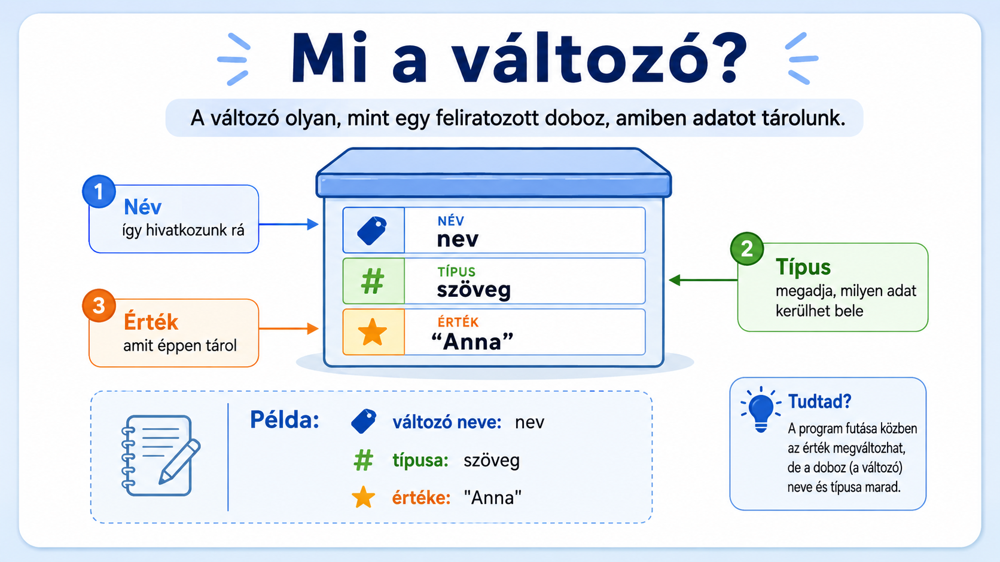
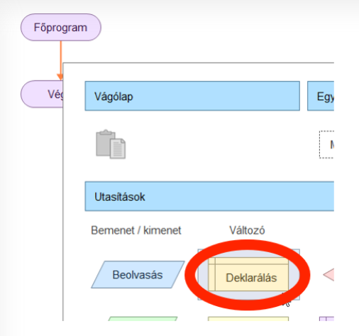
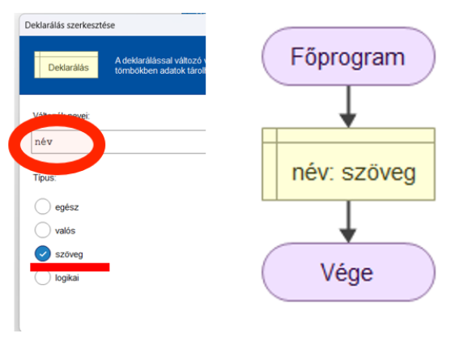

# 📦 Deklarálás (változó)

  

    FLOWGORITHM · VÁLTOZÓ
    <h2>Deklarálás – hozz létre egy változót!</h2>
    
A változó olyan, mint egy <strong>feliratozott doboz</strong>: adatot tárolsz benne, és a nevével később újra elő tudod venni.

  

  
📦

  👀 kezdőknek
  ⏱️ 4–6 perc
  📦 adatok tárolása

  <strong>Mire jó?</strong>
  Ha a programodnak egy adatot később is használnia kell, azt változóban tárolod. Ilyen adat lehet például egy név, egy életkor, egy mért érték vagy egy igaz/hamis állapot.

## Mi az a változó?

<figure class="tool-figure tool-figure--wide">
  
  <figcaption>A változónak van <strong>neve</strong>, <strong>típusa</strong> és később <strong>értéke</strong> is lehet.</figcaption>
</figure>

  
🏷️<strong>Név</strong>Így hivatkozol a változóra később.

  
🧩<strong>Típus</strong>Megadja, milyen adat kerülhet bele.

  
⭐<strong>Érték</strong>Az az adat, amit a változó éppen tárol.

!!! tip "Ezt jegyezd meg!"
    A változó <strong>értéke megváltozhat</strong> a program futása közben, de a neve és a típusa ugyanaz marad.

## 1. Válaszd a Deklarálás elemet!

Kattints arra a piros vonalra, ahová a változó létrehozását szeretnéd tenni, majd válaszd a **Deklarálás** elemet!

<figure class="tool-figure tool-figure--wide">
  
  <figcaption>Válaszd a <strong>Deklarálás</strong> elemet!</figcaption>
</figure>

## 2. Add meg a változó nevét és típusát!

Adj a változónak olyan nevet, amelyből később is könnyen kiderül, mit tárol. Például egy név tárolásához jó változónév lehet a **név**.

Ezután válaszd ki a megfelelő típust!

<figure class="tool-figure tool-figure--wide">
  
  <figcaption>Példa: a változó neve <strong>név</strong>, a típusa <strong>szöveg</strong>.</figcaption>
</figure>

## Milyen típust válassz?

  
🔢<strong>egész</strong>Egész számokhoz, például: 12

  
📐<strong>valós</strong>Tizedes számokhoz, például: 3.5

  
💬<strong>szöveg</strong>Szavakhoz és mondatokhoz, például: „Anna”

  
✅<strong>logikai</strong>Kétféle állapothoz: igaz vagy hamis.

  <strong>Miért számít a típus?</strong>
  A programnak tudnia kell, milyen adatot szeretnél tárolni. Egy névhez <strong>szöveg</strong>, egy életkorhoz általában <strong>egész</strong>, egy mért hőmérséklethez pedig gyakran <strong>valós</strong> típus illik.

!!! warning "Gyakori hiba"
    Ne adj túl általános nevet a változónak! Az <strong>x</strong> vagy <strong>adat</strong> helyett jobb lehet például az <strong>életkor</strong>, <strong>hőmérséklet</strong> vagy <strong>név</strong>. Így később könnyebb lesz megérteni a saját programodat is.

## Gyors ellenőrzés

  <label><input type="checkbox">Létrehoztam egy <strong>Deklarálás</strong> elemet.</label>
  <label><input type="checkbox">Olyan nevet adtam a változónak, amelyből kiderül, mit tárol.</label>
  <label><input type="checkbox">A tárolni kívánt adathoz megfelelő típust választottam.</label>
  <label><input type="checkbox">A folyamatábrában megjelent a létrehozott változó.</label>

!!! note "A jelölések nem mentődnek"
    A pipák csak ezen az oldalon látszanak. Az oldal bezárása után nem maradnak meg.

## Következő lépés

A változó már létezik. A következő kérdés az lesz, **hogyan kerül bele adat**.

<a href="../">← Vissza a Flowgorithm eszköztárhoz</a>

