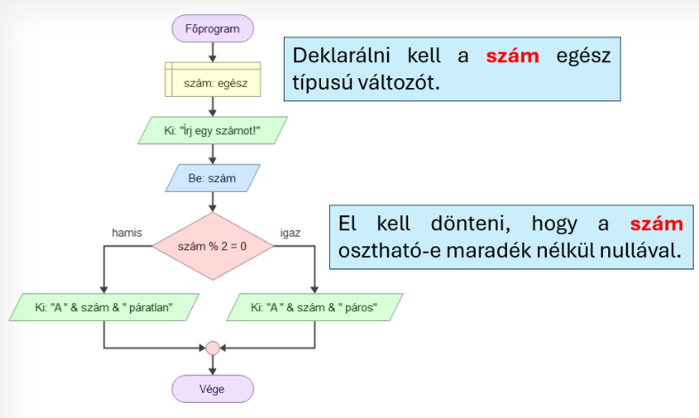
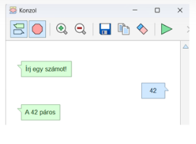
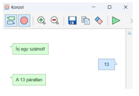

# 🔀 Elágazás

  

    FLOWGORITHM · DÖNTÉS
    <h2>Elágazás – amikor a program dönt</h2>
    
Az <strong>elágazás</strong> segítségével a program egy feltétel alapján két különböző úton folytathatja a működését.

  

  
🔀

  👀 kezdőknek
  ⏱️ 5–8 perc
  🧠 feltétel és döntés

  <strong>Mire jó?</strong>
  Ha a programnak másképp kell viselkednie attól függően, hogy egy feltétel igaz vagy hamis, elágazást használunk.

## Hogyan működik?

  
❓<strong>Feltétel</strong>A program megvizsgál egy kérdést.

  
✅<strong>Igaz ág</strong>Ezen az úton halad tovább, ha a feltétel igaz.

  
❌<strong>Hamis ág</strong>Ezen az úton halad tovább, ha a feltétel hamis.

> **Gondolkodási minta:** feltétel → döntés → egyik ág → közös folytatás

## Példa: páros vagy páratlan?

A program kérjen be egy egész számot, majd döntse el róla, hogy páros vagy páratlan!

<figure class="tool-figure tool-figure--wide">
  
  <figcaption>A teljes folyamat: deklarálás → beolvasás → feltétel → két lehetséges ág.</figcaption>
</figure>

## Mit jelent a feltétel?

A példában ezt vizsgáljuk:

`szám % 2 = 0`

  
➗<strong>%</strong>Az osztás maradékát adja meg.

  
2️⃣<strong>% 2</strong>Megnézzük, mennyi a szám kettővel való osztásának maradéka.

  
0️⃣<strong>= 0</strong>Ha nincs maradék, a szám páros.

!!! tip "Ezt jegyezd meg!"
    Az elágazásnál mindig egy <strong>igaz vagy hamis eredményű feltételt</strong> vizsgálunk. A program nem „találgat”: a feltétel eredménye dönti el, melyik ágon halad tovább.

## Két különböző futás

<figure class="tool-figure tool-figure--medium">
  
  <figcaption>Példa: 42 esetén a feltétel igaz, ezért a program a páros ágat választja.</figcaption>
</figure>

<figure class="tool-figure tool-figure--medium">
  
  <figcaption>Példa: 13 esetén a feltétel hamis, ezért a program a páratlan ágat választja.</figcaption>
</figure>

## Gyors ellenőrzés

  <label><input type="checkbox">A feltétel eredménye <strong>igaz vagy hamis</strong> lehet.</label>
  <label><input type="checkbox">Az igaz és a hamis ágra külön utasításokat tettem.</label>
  <label><input type="checkbox">Mindkét lehetőséget kipróbáltam futtatással.</label>
  <label><input type="checkbox">Értem, mit jelent a példában a <strong>% 2 = 0</strong> feltétel.</label>

!!! note "A jelölések nem mentődnek"
    A pipák csak ezen az oldalon látszanak. Az oldal bezárása után nem maradnak meg.

## Kapcsolódó segítség

  <a href="../beolvasas/">
    ⌨️
    <strong>Adat beolvasása</strong><small>Ha a döntéshez a felhasználótól kérsz adatot.</small>
  </a>
  <a href="../deklaralas/">
    📦
    <strong>Deklarálás</strong><small>Ha változóra van szükséged a feltételben.</small>
  </a>

<a href="../">← Vissza a Flowgorithm eszköztárhoz</a>

