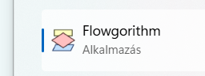

# ▶️ Flowgorithm indítása

  <strong>Mire jó?</strong>
  Itt indul minden. Megnyitod a Flowgorithmot, felismered az üres folyamatábrát, és tudod, honnan kezded majd felépíteni a programodat.

## 1. Indítsd el a programot!

Keresd meg a **Flowgorithm** alkalmazást, majd indítsd el!

<figure class="article-figure">
  
  <figcaption>A Flowgorithm alkalmazás.</figcaption>
</figure>

## 2. Ezt látod induláskor

Az új program egy nagyon egyszerű folyamatábrával indul:

- **Főprogram** – innen indul a program;
- **Vége** – itt ér véget;
- a kettő közötti vonalra kerülnek majd az utasítások.

<figure class="article-figure">
  
  <figcaption>Az üres folyamatábra: Főprogram → Vége.</figcaption>
</figure>

!!! tip "Ezt figyeld meg!"
    A program lépései mindig valamilyen sorrendben követik egymást. A folyamatábra ezt a sorrendet teszi láthatóvá.

## Következő lépés

Most már azt kell tudnod, **hogyan tudsz új elemet beszúrni** a Főprogram és a Vége közé.

<a href="valaszthato-elemek/">Tovább: Választható elemek →</a>

