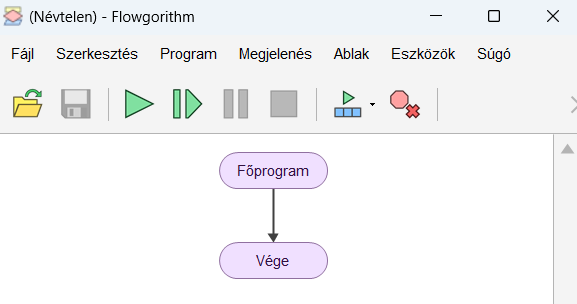

# ▶️ Flowgorithm indítása

  

    FLOWGORITHM · KEZDÉS
    <h2>Flowgorithm indítása</h2>
    
Itt indul minden. Megnyitod a programot, felismered az üres folyamatábrát, és tudod, honnan kezded majd felépíteni a saját programodat.

  

  
▶️

  👀 kezdőknek
  ⏱️ 1–2 perc
  🧠 alaplépés

  <strong>Mire jó?</strong>
  Ha még soha nem használtad a Flowgorithmot, innen indulj!

## 1. Indítsd el a programot!

Keresd meg a **Flowgorithm** alkalmazást, majd indítsd el!

<figure class="tool-figure tool-figure--medium">
  
  <figcaption>A Flowgorithm alkalmazás.</figcaption>
</figure>

## 2. Ezt látod induláskor

Az új program egy nagyon egyszerű folyamatábrával indul:

- **Főprogram** – innen indul a program;
- **Vége** – itt ér véget;
- a kettő közötti vonalra kerülnek majd az utasítások.

<figure class="tool-figure tool-figure--medium">
  
  <figcaption>Az üres folyamatábra: Főprogram → Vége.</figcaption>
</figure>

!!! tip "Ezt figyeld meg!"
    A program lépései valamilyen sorrendben követik egymást. A folyamatábra ezt a sorrendet teszi láthatóvá.

## Következő lépés

Most már azt kell tudnod, **hogyan tudsz új elemet beszúrni** a Főprogram és a Vége közé.

  <a href="../valaszthato-elemek/">
    ➕
    <strong>Választható elemek</strong><small>Így szúrsz be új lépést a folyamatábrába.</small>
  </a>

<a href="../">← Vissza a Flowgorithm eszköztárhoz</a>

