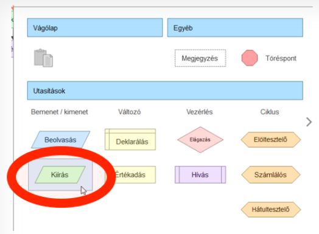
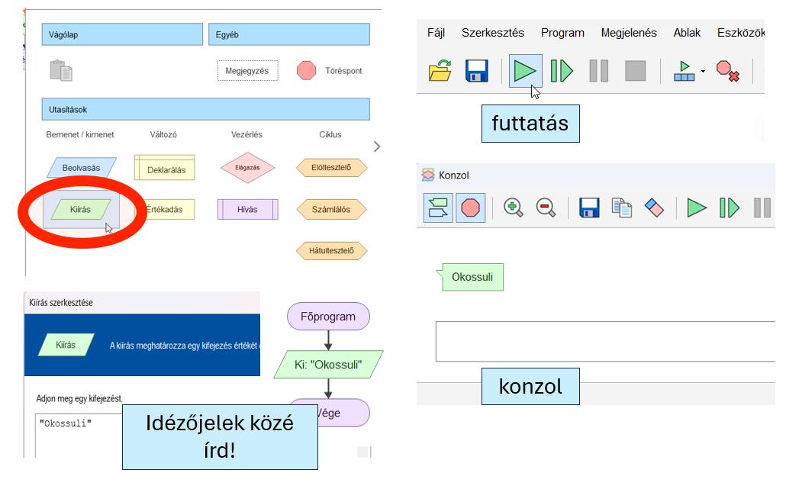
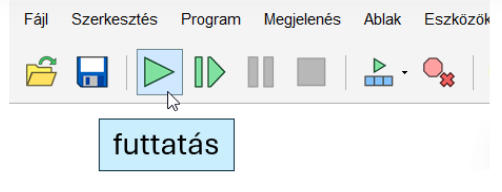
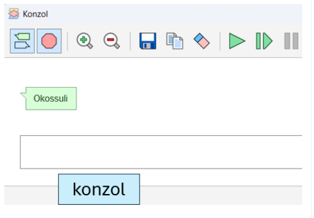

# 💬 Szöveg kiírása

<div class="article-hero">
  <div>
    <span class="article-kicker">FLOWGORITHM · KIMENET</span>
    <h2>Szöveg kiírása</h2>
    <p>Ha azt szeretnéd, hogy a program valamilyen üzenetet jelenítsen meg, a <strong>Kiírás</strong> elemet használod.</p>
  </div>
  <div class="article-hero__icon">💬</div>
</div>

<div class="article-meta">
  <span>👀 kezdőknek</span>
  <span>⏱️ 3–5 perc</span>
  <span>💬 kimenet</span>
</div>

<div class="article-intro">
  <strong>Mire jó?</strong>
  <span>Üzenetet, utasítást vagy eredményt jeleníthetsz meg a program futása közben.</span>
</div>

## 1. Válaszd ki a Kiírás elemet!

Kattints arra a piros vonalra, ahová az új lépést szeretnéd tenni, majd válaszd a **Kiírás** elemet!

<figure class="tool-figure tool-figure--wide">
  
  <figcaption>Válaszd a Kiírás elemet!</figcaption>
</figure>

## 2. Írd be a megjelenítendő szöveget!

A kiírandó szöveget **idézőjelek közé** írd!

Például:

```text
"Szia!"
```

<figure class="tool-figure tool-figure--wide">
  
  <figcaption>A megjelenítendő szöveg megadása.</figcaption>
</figure>

!!! warning "Fontos"
    Ha valódi szöveget szeretnél kiírni, az idézőjelekre szükség van. Nélkülük a Flowgorithm nem egyszerű szövegként értelmezi, amit beírtál.

## 3. Futtasd a programot!

Indítsd el a programot, és figyeld meg az eredményt!

<figure class="tool-figure tool-figure--medium">
  
  <figcaption>Futtasd le a folyamatábrát!</figcaption>
</figure>

## 4. Ellenőrizd az eredményt!

Ha mindent jól adtál meg, a beírt szöveg megjelenik a program kimenetében.

<figure class="tool-figure tool-figure--medium">
  
  <figcaption>A kész eredmény.</figcaption>
</figure>

!!! tip "Ezt figyeld meg!"
    A **Kiírás** elem csak megjelenít valamit. Ha azt szeretnéd, hogy a felhasználó írjon be adatot, ahhoz majd a **Beolvasás** elemre lesz szükséged.

<div class="back-link"><a href="../">← Vissza a Flowgorithm eszköztárhoz</a></div>
