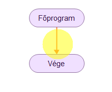
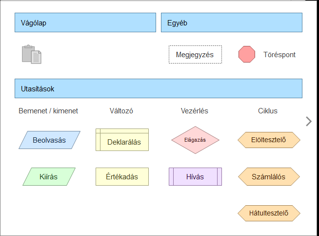

# ➕ Választható elemek

  

    FLOWGORITHM · ALAPMŰVELET
    <h2>Választható elemek</h2>
    
Ha új lépést szeretnél hozzáadni a folyamatábrához, először ki kell választanod a helyét, majd azt, milyen típusú elemre van szükséged.

  

  
➕

  👀 kezdőknek
  ⏱️ 2–3 perc
  🧠 alapművelet

  <strong>Mire jó?</strong>
  Szinte minden új programlépésnél innen indulsz: kiírásnál, beolvasásnál, változónál, elágazásnál és ciklusnál is.

## 1. Kattints a piros vonalra!

A folyamatábrában az új elem helyét a **piros vonal** jelzi. Kattints arra a vonalra, ahová az új utasítást szeretnéd beszúrni!

<figure class="tool-figure tool-figure--medium">
  
  <figcaption>A piros vonal mutatja, hová kerül az új elem.</figcaption>
</figure>

## 2. Válaszd ki a szükséges elemet!

A kattintás után megjelenik az elemválasztó ablak. Itt több csoportból választhatsz.

<figure class="tool-figure tool-figure--wide">
  
  <figcaption>Az elemválasztó ablak fő csoportjai.</figcaption>
</figure>

## A legfontosabb csoportok

  
⌨️<strong>Bemenet / kimenet</strong>Adat beolvasása vagy valami kiírása.

  
📦<strong>Változó</strong>Adatok tárolása és értékadása.

  
🔀<strong>Vezérlés</strong>Például elágazás.

  
🔁<strong>Ciklus</strong>Ismétlődő műveletekhez.

!!! tip "Ezt figyeld meg!"
    Nem az a cél, hogy minden elemet fejből ismerj. Először azt gondold végig, **mit szeretnél csinálni**, és ahhoz keresd meg a megfelelő elemet.

## Következő lépés

Próbáljunk ki egy konkrét elemet: írassunk ki egy rövid szöveget!

  <a href="../szoveg-kiirasa/">
    💬
    <strong>Szöveg kiírása</strong><small>Jeleníts meg üzenetet vagy eredményt.</small>
  </a>

<a href="../">← Vissza a Flowgorithm eszköztárhoz</a>

