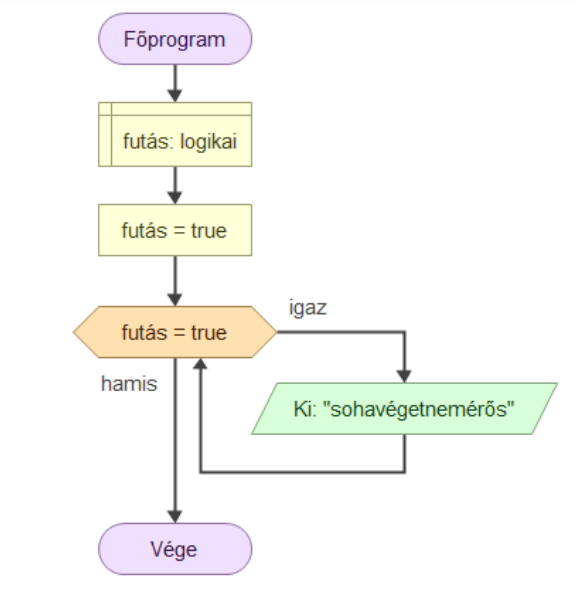

# 🔁 Végtelen ciklus

  

    FLOWGORITHM · CIKLUS
    <h2>Végtelen ciklus – amikor a program folyamatosan ismétel</h2>
    
A végtelen ciklus olyan ismétlés, amelynek nincs természetes vége. Ez lehet <strong>hiba</strong>, de lehet teljesen <strong>szándékos működés</strong> is.

  

  
🔁

  👀 kezdőknek
  ⏱️ 4–6 perc
  🔁 folyamatos működés

  <strong>Mire jó?</strong>
  Ha a programnak működés közben folyamatosan figyelnie, ellenőriznie vagy ismételnie kell valamit, szándékosan is használhatunk végtelen ciklust.

## Mikor hasznos?

  
🌡️<strong>Érzékelők figyelése</strong>A program újra és újra ellenőrzi a környezetet.

  
🎮<strong>Játékok</strong>A játék fő ciklusa folyamatosan frissíti az állapotot.

  
🤖<strong>Vezérlés</strong>A rendszer újra és újra dönthet és reagálhat.

  <strong>Fontos különbség</strong>
  A végtelen ciklus <strong>nem önmagában hiba</strong>. Akkor probléma, ha véletlenül jön létre, és a program nem tud belőle kilépni. Ha viszont a folyamatos működés a cél, akkor szándékosan használjuk.

## Példa Flowgorithmban

<figure class="tool-figure tool-figure--wide">
  
  <figcaption>Amíg a feltétel igaz marad, a ciklus újra és újra végrehajtja a benne lévő utasítást.</figcaption>
</figure>

## Mi történik ebben a példában?

  
1
<strong>Létrejön egy logikai változó.</strong>A <strong>futás</strong> változó igaz vagy hamis értéket tárolhat.

  
2
<strong>A futás értéke igaz lesz.</strong>Ezután a ciklus feltétele teljesül.

  
3
<strong>A ciklus újra és újra lefut.</strong>Mivel a feltétel igaz marad, nincs természetes kilépési pont.

!!! warning "Mikor lesz ebből hiba?"
    Ha a ciklusnak egyszer véget kellene érnie, de a feltétel soha nem változik hamisra, a program „beleragad” az ismétlésbe. Ez tipikus programozási hiba.

!!! tip "Miért fontos ez érzékelőknél?"
    Egy érzékelőt általában nem csak egyszer akarunk megnézni. A program folyamatosan újraolvassa az adatot, dönt róla, reagál, majd kezdi elölről.

  <strong>Gondolkodási minta</strong>
  <strong>ÉRZÉKELÉS → DÖNTÉS → REAKCIÓ → újra ÉRZÉKELÉS</strong>

## Gyors ellenőrzés

  <label><input type="checkbox">Tudom, miért nem ér véget a ciklus.</label>
  <label><input type="checkbox">Meg tudom mondani, hogy ebben a helyzetben szándékos-e a végtelen ismétlés.</label>
  <label><input type="checkbox">Értem, hogy egy érzékelő folyamatos figyeléséhez miért lehet szükség ciklusra.</label>

!!! note "A jelölések nem mentődnek"
    A pipák csak ezen az oldalon látszanak. Az oldal bezárása után nem maradnak meg.

<a href="../">← Vissza a Flowgorithm eszköztárhoz</a>

