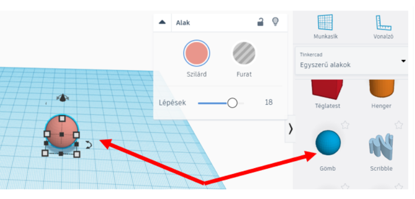
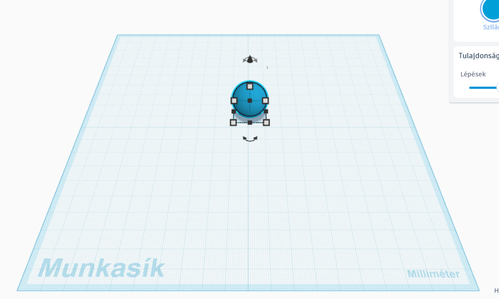
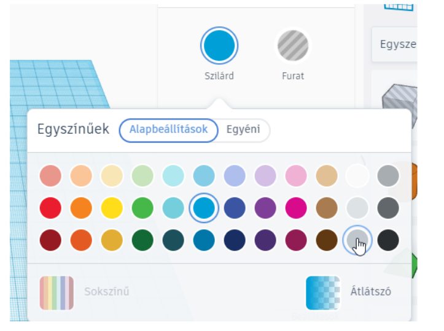

# 🧱 Alakzatok és munkasík

  

    TINKERCAD · ALAPMŰVELET
    <h2>Alakzat kiválasztása és elhelyezése</h2>
    
Az egyszerű 3D modellek alapformákból épülnek fel. Ezen az oldalon azt nézzük meg, hogyan válassz alakzatot, hogyan tedd a munkasíkra, és hogyan változtasd meg a megjelenési színét.

  

  
🧱

  ⏱️ 3–5 perc
  🎯 Alapművelet
  🧩 Modellezés kezdete

## Mire jó?

  <strong>Az első lépés a modellezéshez</strong>
  A Tinkercadben legtöbbször egyszerű alakzatokból indulsz ki. Ezeket a munkasíkra helyezed, majd később méretezed, mozgatod, forgatod vagy más alakzatokkal kombinálod.

## Lépésről lépésre

  
1
<strong>Válassz egy alakzatot!</strong>A jobb oldali alakzatpanelről válaszd ki azt az alapformát, amelyre szükséged van.

<figure class="tool-figure tool-figure--wide">
  
  <figcaption>Az alapformák közül válaszd ki a szükséges alakzatot!</figcaption>
</figure>

  
2
<strong>Húzd az alakzatot a munkasíkra!</strong>A kék rácsos terület a munkasík. Ide helyezed el az új alakzatokat.

<figure class="tool-figure tool-figure--wide">
  
  <figcaption>A munkasík az a felület, amelyre az alakzatokat elhelyezed.</figcaption>
</figure>

!!! tip "Mi a munkasík?"
    Gondolj rá úgy, mint egy digitális asztallapra. A modellezés elején az alakzatokat erre a felületre teszed. Később lehet más felületet is munkasíkként használni, de erre az alapműveleteknél még nincs szükséged.

  
3
<strong>Ha szeretnéd, változtasd meg az alakzat színét!</strong>Jelöld ki az alakzatot, majd a színbeállításnál válassz másik színt.

<figure class="tool-figure tool-figure--wide">
  
  <figcaption>A szín segíthet a különböző elemek vizuális megkülönböztetésében.</figcaption>
</figure>

!!! info "A Tinkercad színe nem a nyomtatás színe"
    A Tinkercadben beállított szín elsősorban a **virtuális megjelenést** segíti. 3D nyomtatáskor a tárgy tényleges színét alapvetően a nyomtatóba helyezett **filament színe** adja. Attól, hogy a modellen például piros színt választasz, a nyomtatás nem lesz automatikusan piros.

!!! note "És mi történik csoportosításkor?"
    Több alakzat csoportosításakor a Tinkercad alaphelyzetben egységes színnel jelenítheti meg a csoportot. A különböző színek megtartására is van lehetőség, de ez már inkább haladóbb megjelenítési beállítás. A **Csoportosítás és szétbontás** oldalon térünk vissza rá.

## Gyors ellenőrzés

  <label><input type="checkbox">Ki tudok választani egy alapformát.</label>
  <label><input type="checkbox">El tudom helyezni az alakzatot a munkasíkon.</label>
  <label><input type="checkbox">Tudom, hogy a kék rácsos felület a munkasík.</label>
  <label><input type="checkbox">Meg tudom változtatni az alakzat virtuális színét.</label>
  <label><input type="checkbox">Tudom, hogy 3D nyomtatásnál a filament színe számít.</label>

## Kapcsolódó segítség

  <a href="../mozgas-forgatas-emeles/">
    🔄
    <strong>Mozgatás, forgatás és emelés</strong><small>Ha már elhelyezted az alakzatot, de más helyre vagy más irányba szeretnéd tenni.</small>
  </a>
  <a href="../meretezes/">
    📏
    <strong>Méretezés és igazítás</strong><small>Ha pontos méretet szeretnél beállítani.</small>
  </a>

<a href="../">← Vissza a Tinkercad eszköztárhoz</a>

