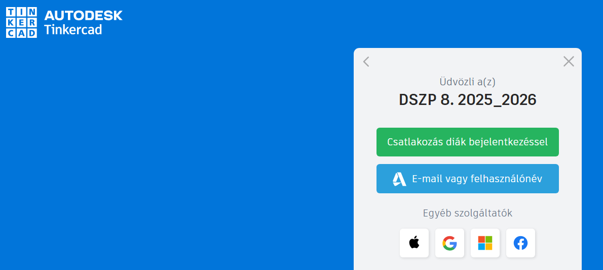
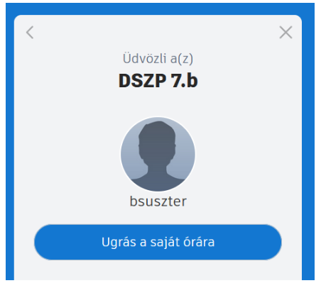
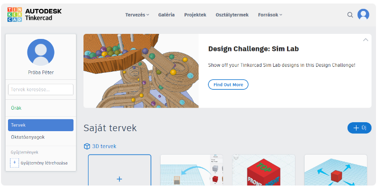
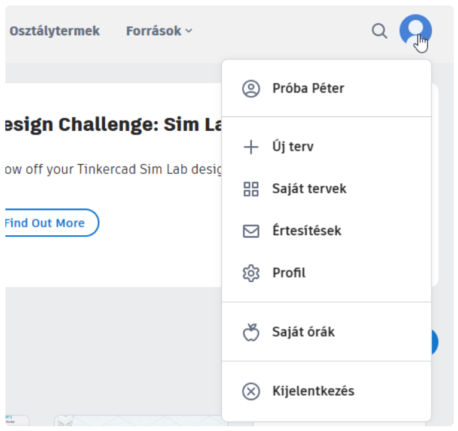

# 🔐 Bejelentkezés és csatlakozás

  

    TINKERCAD · KEZDÉS
    <h2>Juss el az osztályteremtől a saját munkafelületedig!</h2>
    
Ha a tanárod Tinkercad-osztálytermet használ, <strong>saját Autodesk-fiók nélkül is</strong> csatlakozhatsz. Az osztályhoz tartozó linket vagy kódot mindig az aktuális tananyagban kapod meg.

  

  
🔐

  👀 első használathoz
  ⏱️ 2–3 perc
  🏫 osztálytermi belépés

  <strong>Mire jó?</strong>
  Megmutatja az osztálytermi csatlakozás általános menetét. A saját osztályodhoz tartozó linket és a használandó belépési adatot mindig az aktuális tananyagban keresd!

## 1. Nyisd meg az osztályod Tinkercad-linkjét!

Az aktuális tananyagban kapott hivatkozás a megfelelő Tinkercad-osztályteremhez visz.

  <strong>🟢 Ezt keresd!</strong>
  Az első képernyőn <strong>a zöld gombra kattints!</strong> Ez indítja el az osztályteremhez való csatlakozást.

<figure class="tool-figure tool-figure--wide">
  
  <figcaption>Az osztálytermi belépéshez <strong>a zöld gombot válaszd!</strong></figcaption>
</figure>

## 2. Add meg a kért bejelentkezési adatot!

Az osztálytermi belépésnél a tanárod által megadott becenevet vagy kódot használd. Ennek pontos formája osztályonként eltérhet, ezért ezt nem az eszköztárban, hanem az aktuális tananyagban találod meg.

<figure class="tool-figure tool-figure--medium">
  
  <figcaption>A belépéshez mindig az <strong>aktuális tananyagban megadott</strong> adatot használd!</figcaption>
</figure>

!!! warning "Ne találj ki új nevet vagy kódot!"
    Ha nem tudsz belépni, először ellenőrizd a tananyagban kapott információt. Ha az sem segít, szólj a tanárnak!

## 3. Ellenőrizd, hogy a saját Tinkercad-felületedre jutottál!

Sikeres belépés után a Tinkercad főoldala fogad. Innen eléred a saját terveidet, és innen tudsz új 3D tervet is indítani.

<figure class="tool-figure tool-figure--wide">
  
  <figcaption>Ha ezt a felületet látod, sikerült belépned.</figcaption>
</figure>

## 4. Munka végén jelentkezz ki!

Különösen közösen használt iskolai gépen fontos, hogy a munka végén ne hagyd nyitva a saját Tinkercad-munkaterületedet.

<figure class="tool-figure tool-figure--medium">
  
  <figcaption>A profilmenüben találod a <strong>Kijelentkezés</strong> lehetőségét.</figcaption>
</figure>

## Gyors ellenőrzés

  <label><input type="checkbox">Az aktuális tananyagban kapott osztálytermi linket nyitottam meg.</label>
  <label><input type="checkbox">A csatlakozásnál a <strong>zöld gombra</strong> kattintottam.</label>
  <label><input type="checkbox">A megadott belépési adatot használtam.</label>
  <label><input type="checkbox">Belépés után elérem a saját Tinkercad-felületemet.</label>

!!! note "A jelölések nem mentődnek"
    A pipák csak ezen az oldalon látszanak. Az oldal bezárása után nem maradnak meg.

## Következő lépés

  <a href="../uj-terv/">
    🆕
    <strong>Új 3D terv létrehozása</strong><small>Ha már bejutottál, innen indulhat a saját modelled.</small>
  </a>

<a href="../">← Vissza a Tinkercad eszköztárhoz</a>

