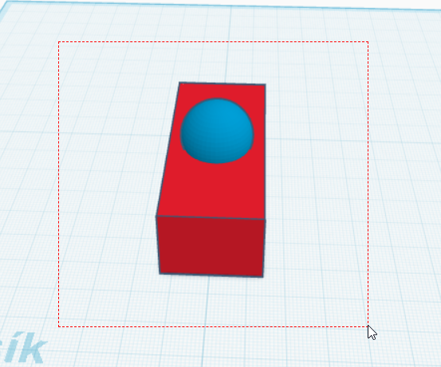
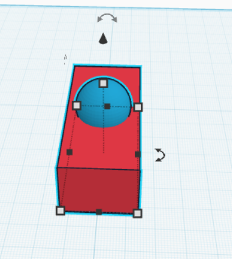
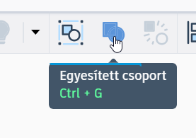
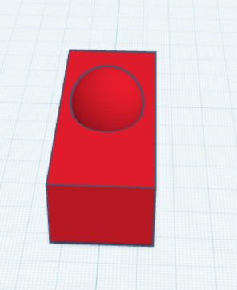
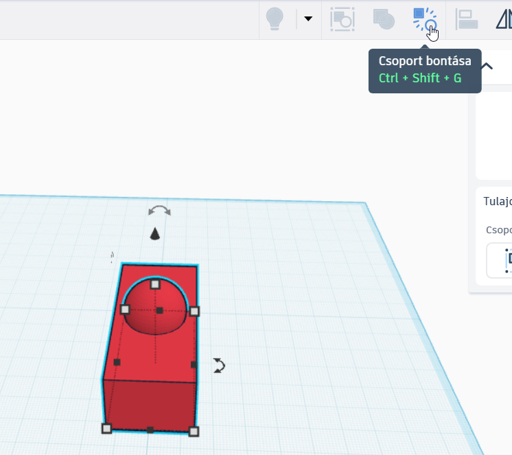
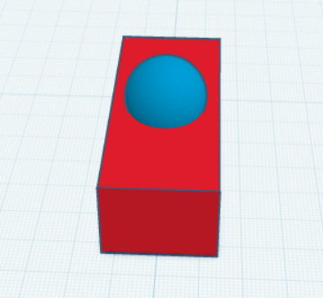

# 🧩 Csoportosítás és szétbontás

  

    TINKERCAD · SZERKESZTÉS
    <h2>Több elemből egy összetett forma</h2>
    
A csoportosítással több alakzatot egyetlen objektumként kezelhetsz. Így együtt mozgathatod, forgathatod vagy méretezheted őket, és erre a műveletre lesz szükséged a furatkészítésnél is.

  

  
🧩

  ⏱️ 2–4 perc
  🎯 Több elem közös kezelése
  🕳️ A furatkészítés előfeltétele

  <strong>Mire jó?</strong>
  Ha több alakzat együtt alkot egy tárgyrészt, érdemes őket csoportosítani. A csoport később újra szétbontható, ezért a szerkesztés nem végleges.

## 1. Jelölj ki több alakzatot!

Több elemet két egyszerű módon is kijelölhetsz.

### Kijelölőkerettel

Húzz az egérrel egy kijelölőkeretet az alakzatok köré! Minden olyan elem kijelölődik, amely teljesen belekerül a keretbe.

<figure class="tool-figure tool-figure--wide">
  
  <figcaption>Több egymáshoz közeli alakzatnál a kijelölőkeret a leggyorsabb módszer.</figcaption>
</figure>

### Egyesével

Ha nem egymás mellett vannak az elemek, jelöld ki az elsőt, majd a **Shift** billentyűt lenyomva tartva kattints a további alakzatokra!

<figure class="tool-figure tool-figure--wide">
  
  <figcaption>A Shift segítségével egymástól távolabb lévő elemeket is hozzáadhatsz a kijelöléshez.</figcaption>
</figure>

!!! tip "Ellenőrizd a kijelölést!"
    Csoportosítás előtt nézd meg, hogy valóban minden szükséges elem ki van-e jelölve, és nincs-e köztük véletlenül olyan, amelyet nem akarsz a csoportba tenni.

## 2. Csoportosítsd az elemeket!

Ha minden szükséges alakzat ki van jelölve, kattints a **Csoportosítás / Group** gombra! Használhatod a **Ctrl + G** billentyűkombinációt is.

<figure class="tool-figure tool-figure--medium">
  
  <figcaption>A Csoportosítás gomb több kijelölt alakzatból egy közös objektumot készít.</figcaption>
</figure>

<figure class="tool-figure tool-figure--wide">
  
  <figcaption>Csoportosítás után az elemek egyetlen objektumként jelölhetők ki és mozgathatók.</figcaption>
</figure>

  <strong>Mit jelent ez?</strong>
  A csoportosítás nem „ragasztja össze végleg” az elemeket. A Tinkercad megőrzi az alkotórészeket, ezért később újra szétbonthatod a csoportot.

!!! info "Mi történik a színekkel?"
    Csoportosításkor a csoport alapértelmezésben egységes színt kaphat. A különböző színek megtartására is van lehetőség, de ezt itt nem szükséges használnod: a szín a virtuális megjelenést segíti, a 3D nyomtatásnál pedig alapvetően a filament színe számít.

## 3. Bontsd szét, ha újra szerkesztenéd!

Ha a csoport egyik elemén külön szeretnél változtatni, jelöld ki a csoportot, majd válaszd a **Szétbontás / Ungroup** műveletet! Gyorsbillentyűvel ugyanez: **Ctrl + Shift + G**.

<figure class="tool-figure tool-figure--wide">
  
  <figcaption>A Szétbontás művelettel a korábban csoportosított elemek újra külön szerkeszthetők.</figcaption>
</figure>

<figure class="tool-figure tool-figure--wide">
  
  <figcaption>Szétbontás után az alkotórészeket ismét külön kijelölheted és módosíthatod.</figcaption>
</figure>

## Mikor érdemes csoportosítani?

  
🧱<strong>Összetett tárgy</strong>Ha több alakzat együtt alkot egy kész tárgyrészt.

  
🔄<strong>Közös mozgatás</strong>Ha több elemet együtt szeretnél mozgatni, forgatni vagy méretezni.

  
🕳️<strong>Furat készítése</strong>A szilárd test és a Furat típusú alakzat csoportosításakor történik meg a kivágás.

  
✏️<strong>Újraszerkesztés</strong>Ha módosítani kell valamelyik részt, bontsd szét, javítsd, majd csoportosítsd újra.

## Gyors ellenőrzés

  <label><input type="checkbox">Tudok több alakzatot kijelölni kijelölőkerettel.</label>
  <label><input type="checkbox">Tudok több alakzatot egyesével kijelölni a Shift segítségével.</label>
  <label><input type="checkbox">Tudom, hogyan kell csoportosítani a kijelölt elemeket.</label>
  <label><input type="checkbox">Tudom, hogyan lehet a csoportot újra szétbontani.</label>

## Következő lépés: furat készítése

A **Furat / Hole** önmagában még nem vág ki semmit. A kivágás akkor készül el, amikor a szilárd testet és a furatként beállított alakzatot **együtt kijelölöd és csoportosítod**.

  <a href="../furat/">
    🕳️
    <strong>Furat készítése</strong><small>Alkalmazd a csoportosítást valódi kivágás készítésére.</small>
  </a>
  <a href="../meretezes/">
    📏
    <strong>Méretezés és igazítás</strong><small>Ha az elemeknek pontosan kell egymáshoz illeszkedniük.</small>
  </a>
  <a href="../gyors-szerkesztes/">
    ↩️
    <strong>Visszavonás és gyors szerkesztés</strong><small>Ha a kijelölés és a gyorsbillentyűk alapjait keresed.</small>
  </a>

<a href="../">← Vissza a Tinkercad eszköztárhoz</a>

