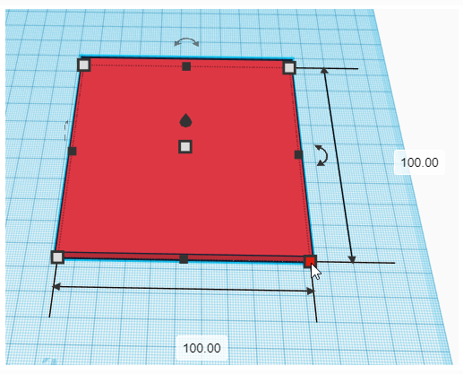
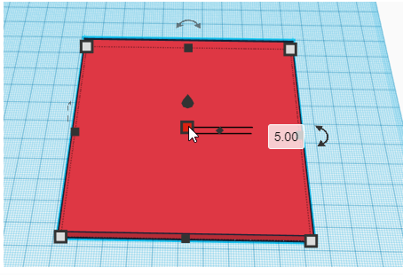
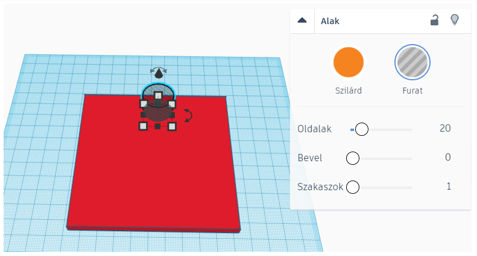
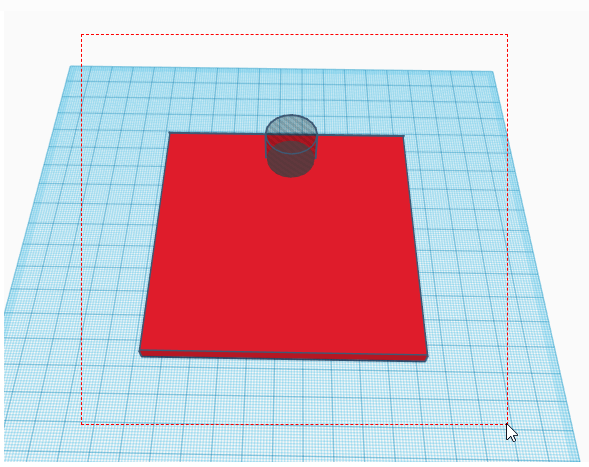
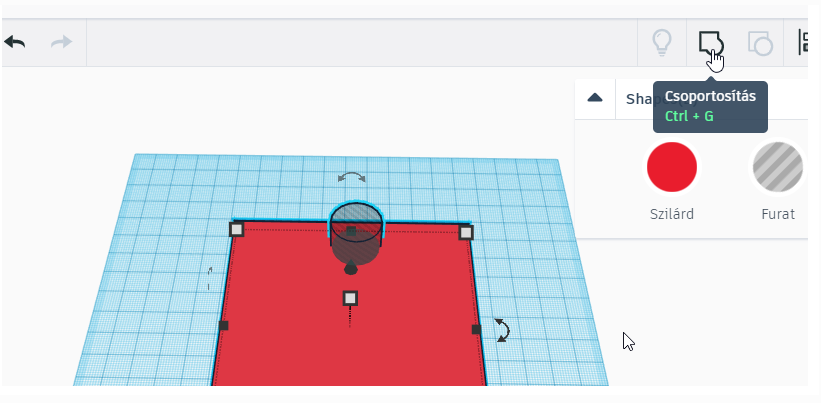
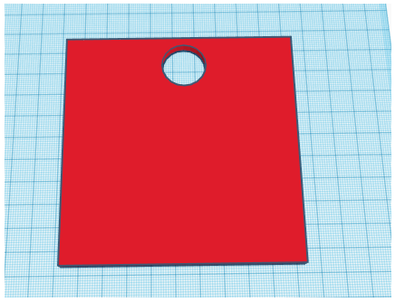

# 🕳️ Furat készítése

  

    TINKERCAD · ALAKÍTÁS
    <h2>Vágj ki pontosan ott, ahol szükséges!</h2>
    
A <strong>Furat / Hole</strong> segítségével egy másik alakzat formáját kivonhatod a modelledből. Így készülhet nyílás, csavarhely, kábelvezető, bemélyedés vagy illeszkedő rész.

  

  
🕳️

  ⏱️ 2–4 perc
  🎯 Alapművelet
  📏 Pontos méretezéshez is használható

  <strong>Előtte ezt érdemes tudnod</strong>
  A furat elkészítéséhez a szilárd testet és a furatként beállított alakzatot csoportosítani kell. Ha ez a művelet még nem biztos, nézd meg előbb a <a href="../csoportositas/"><strong>Csoportosítás és szétbontás</strong></a> segítséget!

## Lépésről lépésre

  
1
<strong>Helyezd el és méretezd az alaptestet!</strong>Állítsd be a szükséges hosszúságot és szélességet.

<figure class="tool-figure tool-figure--wide">
  
  <figcaption>Az alaptest hosszúságának és szélességének beállítása. A képre kattintva nagyobb méretben is megnyithatod.</figcaption>
</figure>

  
2
<strong>Állítsd be az alaptest vastagságát!</strong>A felső fogóponttal add meg, milyen magas legyen a tárgy.

<figure class="tool-figure tool-figure--medium">
  
  <figcaption>Az alaptest vastagságának beállítása.</figcaption>
</figure>

  
3
<strong>Tedd rá vagy bele a kivágó alakzatot, majd állítsd Furat / Hole típusúra!</strong>Arra a helyre kerüljön, ahonnan anyagot szeretnél eltávolítani. A furatként használt alakzat áttetsző, csíkos megjelenést kap.

<figure class="tool-figure tool-figure--wide">
  
  <figcaption>Jelöld ki a kivágó alakzatot, majd válaszd a <strong>Furat</strong> típust.</figcaption>
</figure>

  
4
<strong>Jelöld ki mindkét alakzatot!</strong>Az alaptestet és a furatként használt alakzatot egyszerre kell kijelölni.

<figure class="tool-figure tool-figure--wide">
  
  <figcaption>Húzz kijelölőkeretet úgy, hogy mindkét alakzat belekerüljön.</figcaption>
</figure>

  
5
<strong>Csoportosítsd / Group őket!</strong>A csoportosításkor a furat alakja kivonódik az alaptestből.

<figure class="tool-figure tool-figure--wide">
  
  <figcaption>Kattints a <strong>Csoportosítás</strong> gombra, vagy használd a <strong>Ctrl + G</strong> billentyűkombinációt.</figcaption>
</figure>

  
6
<strong>Ellenőrizd az eredményt!</strong>Forgasd körbe a modellt, és nézd meg, hogy a kivágás valóban olyan lett-e, amilyet terveztél.

<figure class="tool-figure tool-figure--medium">
  
  <figcaption>A csoportosítás után elkészült furat.</figcaption>
</figure>

!!! tip "Előbb méretezz, utána vágj!"
    Ha a furatnak egy másik tárgyhoz kell illeszkednie, a méretét ne szemre állítsd be. Használd a mért adatokat!

## Mire használhatod?

  
🔩<strong>Csavarhely</strong>Rögzítéshez szükséges nyílás.

  
🔌<strong>Kábelnyílás</strong>Vezeték átvezetéséhez.

  
🧩<strong>Illesztés</strong>Másik tárgy vagy alkatrész helyének kialakításához.

  
🔤<strong>Bemélyedés</strong>Szöveg vagy forma besüllyesztéséhez.

## Gyors ellenőrzés

  <label><input type="checkbox">A kivágó alakzat valóban átfedi azt a részt, amit el szeretnék távolítani.</label>
  <label><input type="checkbox">Több irányból is megnéztem a modellt.</label>
  <label><input type="checkbox">Ha pontos illeszkedés kell, nem szemre állítottam be a méretet.</label>
  <label><input type="checkbox">Csoportosítás után ellenőriztem az eredményt.</label>

!!! warning "Gyakori hiba"
    Ha a kivágó alakzat csak hozzáér az alaptesthez, de nem metszi azt eléggé, a csoportosítás után nem a várt kivágás készül. Forgasd körbe a modellt még a csoportosítás előtt!

## Kapcsolódó segítség

  <a href="../csoportositas/">
    🧩
    <strong>Csoportosítás és szétbontás</strong><small>Ha a közös kijelölést, csoportosítást vagy szétbontást szeretnéd átismételni.</small>
  </a>
  <a href="../meretezes/">
    📏
    <strong>Méretezés és igazítás</strong><small>Ha pontos helyre és méretre van szükséged.</small>
  </a>
  <a href="../navigacio/">
    🧭
    <strong>Navigáció</strong><small>Ha több nézetből szeretnéd ellenőrizni a modellt.</small>
  </a>

<a href="../">← Vissza a Tinkercad eszköztárhoz</a>

