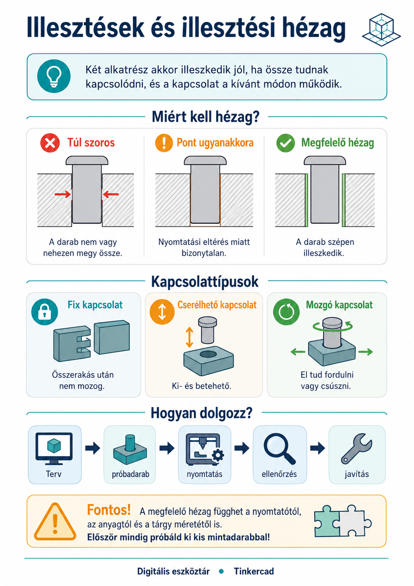
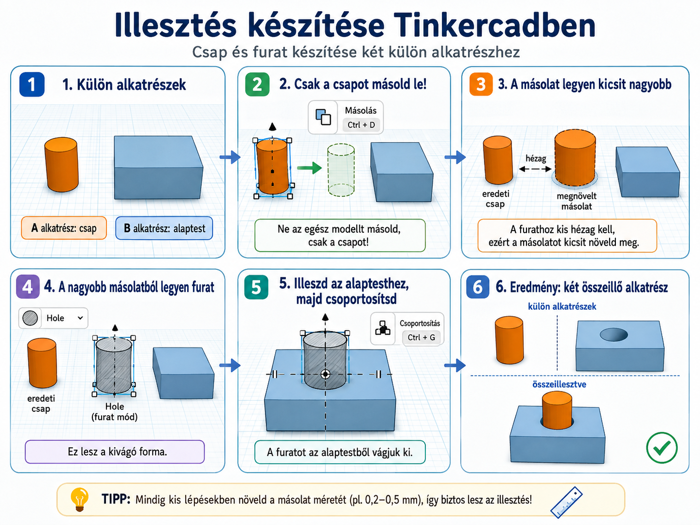

# 🧩 Illesztések és illesztési hézag

  

    TINKERCAD · ILLESZTÉS
    <h2>Két alkatrész ne csak a képernyőn passzoljon!</h2>
    
Ha két külön kinyomtatott résznek egymásba, egymásra vagy egymás köré kell illeszkednie, a pontos méret önmagában nem elég. Meg kell tervezned azt a kis helyet is, amely lehetővé teszi az összerakást és – ha szükséges – a mozgást.

  

  
🧩

  ⏱️ 5–8 perc
  🎯 Egymáshoz kapcsolódó alkatrészek
  📏 Pontos méretezés

  <strong>A legfontosabb szabály</strong>
  Ha egy 10 mm-es csapot pontosan 10 mm-es furatba tervezel, attól még nem biztos, hogy a kinyomtatott darabok összeilleszthetők. A valós alkatrészekhez általában kis <strong>illesztési hézag</strong> szükséges.

<figure class="tool-figure">
  
  <figcaption>Az illesztésnél nemcsak a méret számít: azt is meg kell tervezni, milyen kapcsolatot szeretnél, és mekkora hely szükséges a működéshez.</figcaption>
</figure>

## 1. Mi az illesztés?

Illesztésről akkor beszélünk, amikor két külön alkatrészt úgy tervezel meg, hogy a valóságban kapcsolódjanak egymáshoz.

  
⭕<strong>Csap és furat</strong>Egy kiálló rész belekerül egy nyílásba.

  
↔️<strong>Becsúszó elem</strong>Egy alkatrész egy horonyba vagy vezetékbe csúszik.

  
🔄<strong>Tengely és lyuk</strong>Az egyik résznek a másikban el kell tudnia fordulni.

  
🧢<strong>Ráillesztett elem</strong>Egy alkatrész rákerül vagy ráhúzható egy másikra.

## 2. Miért nem jó a „pont ugyanakkora”?

A 3D nyomtató nem matematikai pontosságú másológép. A kinyomtatott méretet több dolog is befolyásolhatja: a gép pontossága, az anyag, a rétegvastagság és a nyomtatási beállítások.

  <h2>⚠️ Képernyőn tökéletes ≠ valóságban összeillik</h2>
  
Ha a csap és a furat névleg pontosan ugyanakkora, a nyomtatás apró eltérései miatt könnyen előfordulhat, hogy a két alkatrész túl szoros lesz, vagy egyáltalán nem lehet összerakni.

Ezért a kapcsolódó alkatrészek között általában hagyunk egy kis helyet. Ezt nevezzük <strong>illesztési hézagnak</strong>.

## 3. Szoros, laza vagy mozgó legyen?

Nem minden kapcsolatnak ugyanúgy kell működnie. Először azt döntsd el, mit vársz tőle!

  
🔒 <strong>Fix kapcsolat</strong>Összeillesztés után nem akarod mozgatni. Itt kisebb hézag is elegendő lehet.

  
🧩 <strong>Kivehető vagy cserélhető rész</strong>Ki kell tudni venni és vissza kell tudni tenni. Nem szorulhat be.

  
🔄 <strong>Mozgó kapcsolat</strong>Forgás vagy csúszás közben is maradjon szabad hely a két felület között.

  <strong>Nincs egyetlen univerzális hézagérték</strong>
  A jó érték függ a nyomtatótól, az anyagtól, a mérettől és attól is, hogy fix vagy mozgó kapcsolatot szeretnél. Ha a feladat konkrét értéket ad meg, azt használd! Máskor próbadarabbal érdemes beállítani.

## 4. Hogyan tervezz illesztést Tinkercadben?

  
1
<strong>Mérd meg a kapcsolódó alkatrészt!</strong>Ne szemre dolgozz! A fontos méreteket milliméterben add meg.

  
2
<strong>Döntsd el, hogyan kell működnie!</strong>Fixen kapcsolódjon, kivehető legyen, csússzon vagy forogjon?

  
3
<strong>Tervezd bele a hézagot!</strong>A befogadó részt készítsd kissé nagyobbra, vagy a belekerülő részt kissé kisebbre. A lényeg: ne ugyanaz legyen a két névleges méret.

  
4
<strong>Igazítsd pontosan a két elemet!</strong>Használd az igazítást és több nézetet, hogy a csap, furat vagy horony valóban egy tengelyre kerüljön.

  
5
<strong>Próbáld ki valódi nyomtatással!</strong>Az első nyomtatás egyben teszt is. Ha túl szoros vagy túl laza, térj vissza a Tinkercad-tervhez és módosíts!

<figure class="tool-figure">
  
  <figcaption>Csap–furat illesztés készítése: csak a csapot másold le, a másolatból készíts kissé nagyobb kivágó formát, majd ezt igazítsd és csoportosítsd az alaptesttel!</figcaption>
</figure>

  <a href="../meretezes/">
    📏
    <strong>Méretezés és igazítás</strong><small>Pontos méretek és egymáshoz igazított alkatrészek.</small>
  </a>
  <a href="../furat/">
    🕳️
    <strong>Furat készítése</strong><small>Csap–furat vagy más kivágásos kapcsolat kialakításához.</small>
  </a>

## 5. Egy egyszerű gondolkodási példa

Tegyük fel, hogy egy henger alakú csapot szeretnél egy kör alakú furatba tenni.

  <h2>🧠 Ne ezt kérdezd: „Mekkora a csap?”</h2>
  
Hanem ezt:

  
<strong>„Mekkora a csap, milyen kapcsolatot szeretnék, és mekkora helyet kell hagynom körülötte ahhoz, hogy a valóságban is működjön?”</strong>

A két alkatrész méretei tehát <strong>összetartoznak</strong>. Ha az egyiken változtatsz, ellenőrizd a másikat is!

## 6. A próbadarab nem kudarc, hanem mérés

Ha az illesztés fontos, sokszor nem érdemes rögtön az egész tárgyat újranyomtatni. Készíthetsz egy kis próbadarabot ugyanazzal a csappal, furattal vagy horonnyal.

  
6
<strong>Nyomtass kis tesztet!</strong>Csak az illesztéshez szükséges részt készítsd el.

  
7
<strong>Próbáld össze!</strong>Túl szoros? Kiesik? Akad? Nem forog?

  
8
<strong>Módosíts és tesztelj újra!</strong>A jó illesztés gyakran egy rövid tervezés–próba–javítás folyamat eredménye.

  <h2>🔁 Ez is tervezési folyamat</h2>
  
TERV → NYOMTATOTT PRÓBA → ELLENŐRZÉS → JAVÍTÁS → ÚJ PRÓBA

  
Az első változatnak nem kell tökéletesen illeszkednie. Az a fontos, hogy észrevedd, mi a probléma, és a szerkeszthető modellben tudatosan javíts rajta.

## Gyors ellenőrzés

  <label><input type="checkbox">Tudom, melyik két alkatrésznek kell egymáshoz illeszkednie.</label>
  <label><input type="checkbox">Eldöntöttem, hogy fix, kivehető vagy mozgó kapcsolatot szeretnék.</label>
  <label><input type="checkbox">A fontos méreteket számmal ellenőriztem.</label>
  <label><input type="checkbox">Nem terveztem a két kapcsolódó felületet automatikusan pontosan ugyanakkorára.</label>
  <label><input type="checkbox">Az illesztési hézagot a kívánt működéshez választottam.</label>
  <label><input type="checkbox">Ha az illesztés kritikus, számolok próbadarabbal és javítással.</label>

## Kapcsolódó segítségek

  <a href="../nyomtatas-elokeszites/">
    🖨️
    <strong>3D nyomtatásra előkészítés</strong><small>Ellenőrizd, hogy a teljes modell valóban kinyomtatható-e.</small>
  </a>
  <a href="../exportalas-stl/">
    📤
    <strong>Exportálás STL-be</strong><small>A teszthez vagy végleges nyomtatáshoz add át a modellt.</small>
  </a>

<a href="../">← Vissza a Tinkercad eszköztárhoz</a>

