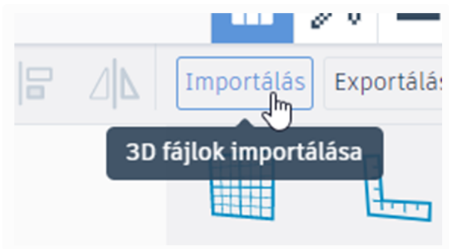
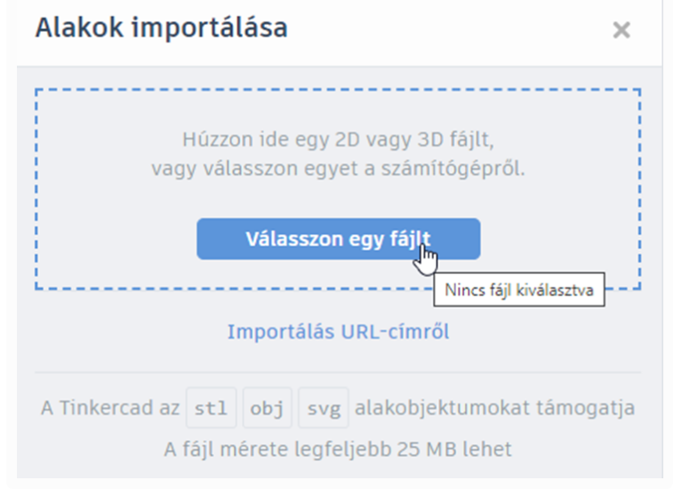
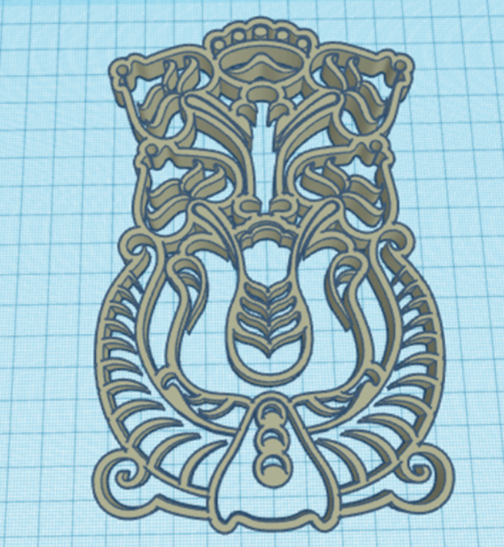

# 📥 Importálás

  

    TINKERCAD · KÜLSŐ ELEM
    <h2>Síkbeli rajzból térbeli forma</h2>
    
Az importálással külső fájlt hozhatsz be a Tinkercadbe. Különösen látványos lehet, amikor egy saját vagy máshol elkészített <strong>SVG-rajzból 3D forma</strong> készül.

  

  
📥

  ⏱️ 4–6 perc
  🎯 SVG vagy 3D fájl beillesztése
  ✨ Saját rajzból is lehet modell

## Mit lehet importálni?

A Tinkercad külső fájlokat is képes fogadni. A 3D szerkesztőben használható formátumok között ott van az **STL**, az **OBJ** és az **SVG** is. Az SVG különösen érdekes, mert egy síkbeli vektoros rajzból térbeli alakzat készíthető.

  
🖼️<strong>SVG</strong>Síkbeli vektoros rajz, logó, jel vagy saját grafika térbeli formává alakításához.

  
🧱<strong>STL / OBJ</strong>Más programban elkészített 3D modell beillesztéséhez.

## Lépésről lépésre

  
1
<strong>Válaszd az Importálás lehetőséget!</strong>A 3D szerkesztő jobb felső részén találod az importálás gombját.

<figure class="tool-figure tool-figure--wide">
  
  <figcaption>Az importálást a szerkesztőből indíthatod.</figcaption>
</figure>

  
2
<strong>Válaszd ki a fájlt!</strong>Tallózd be a számítógépedről az importálni kívánt SVG-, STL- vagy OBJ-fájlt, majd indítsd el az importálást.

<figure class="tool-figure tool-figure--wide">
  
  <figcaption>A fájl kiválasztása után az importálás beállításai jelennek meg.</figcaption>
</figure>

  
3
<strong>Ellenőrizd az eredményt!</strong>SVG esetén a síkbeli rajz térbeli, szerkeszthető alakzattá válik. Nézd meg a méretét és a formáját is, mielőtt továbbépíted!

<figure class="tool-figure tool-figure--wide">
  
  <figcaption>Egy megfelelő SVG-ből néhány lépés alatt saját 3D forma készülhet.</figcaption>
</figure>

## Saját rajzból is készülhet 3D forma

Ez az importálás egyik legizgalmasabb lehetősége. Egy egyszerű rajzot vagy körvonalat először **vektoros SVG-vé** alakíthatsz, majd ezt importálhatod a Tinkercadbe. Így például saját jelből, emblémából, egyszerű figurából vagy kézzel készített rajzból is kiindulhatsz.

  <strong>Fontos: az SVG nem egyszerűen „egy kép másik kiterjesztéssel”</strong>
  Az SVG vektoros leírást tartalmaz. Ha egy PNG vagy JPG képet csak SVG-fájlba ágyaznak, attól még nem válik valódi vektoros rajzzá, és az importálás nem biztos, hogy működni fog.

## Miért nem sikerül minden SVG importálása?

Sajnos attól, hogy egy fájl neve `.svg`-re végződik, még nem biztos, hogy a benne lévő rajz megfelelő a Tinkercad számára. A legbiztosabban az **egyszerű, zárt, kitöltött vektoros formák** működnek.

Gondot okozhat például, ha:

- a fájl valójában beágyazott raszterképet tartalmaz;
- a rajz csak vékony vonalakból áll, nem zárt formákból;
- a körvonalban apró rések vagy hibásan kapcsolódó pontok maradnak;
- túl sok csomópontból vagy nagyon összetett görbékből áll;
- olyan SVG-effektusokat, maszkokat vagy egyéb elemeket használ, amelyeket az importáló nem értelmez jól;
- az importált forma túl nagy vagy aránytalan méretben érkezik.

!!! tip "Ha egy SVG nem működik"
    Nyisd meg egy vektorgrafikus programban – például Inkscape-ben –, egyszerűsítsd a rajzot, alakítsd a szükséges elemeket valódi útvonalakká, ellenőrizd a zárt körvonalakat, majd mentsd újra SVG-ként. Sokszor már ez megoldja a problémát.

!!! warning "Az előnézet sem mindig garancia"
    Előfordulhat, hogy az SVG látszólag rendben van, de importálás után hiányos vagy torz forma jelenik meg. Ilyenkor általában nem maga az `.svg` kiterjesztés a gond, hanem a fájl belső felépítése.

## Importálás után még dolgoznod kell vele

Az importált elem ugyanúgy része lesz a modellednek, mint a Tinkercad saját alakzatai. Ezután például:

- átméretezheted;
- elforgathatod;
- más elemekkel csoportosíthatod;
- furatként is felhasználhatod;
- saját modelled egyik alkatrészévé teheted.

  <label><input type="checkbox">A megfelelő fájltípust választottam ki.</label>
  <label><input type="checkbox">Importálás után ellenőriztem a méretet és a formát.</label>
  <label><input type="checkbox">SVG esetén valódi vektoros formát használok, nem csak átnevezett vagy beágyazott képet.</label>
  <label><input type="checkbox">Ha hibás az eredmény, megpróbálom egyszerűsíteni vagy újramenteni az SVG-t.</label>

## Kapcsolódó segítség

  <a href="../kesz-modellek/">
    🔎
    <strong>Kész modellek keresése</strong><small>Ha nem saját fájlt importálnál, hanem a Tinkercad kész alakzatai között keresnél.</small>
  </a>
  <a href="../meretezes/">
    📏
    <strong>Méretezés és igazítás</strong><small>Az importált elem méretének és helyzetének pontos beállításához.</small>
  </a>

<a href="../">← Vissza a Tinkercad eszköztárhoz</a>

