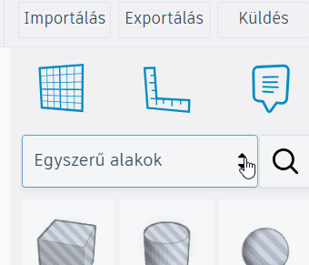
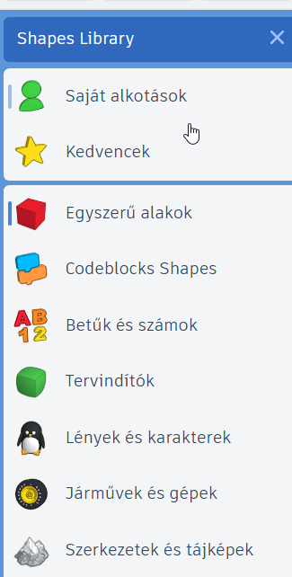
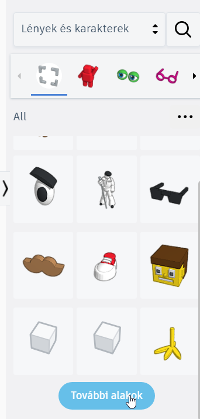
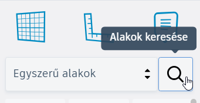
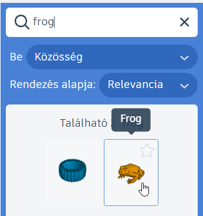
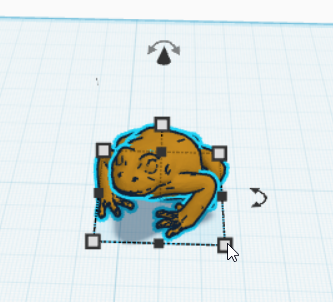

# 🔎 Kész modellek keresése és beillesztése

  

    TINKERCAD · KÉSZ ELEMEK
    <h2>Nem kell mindent alapformákból felépíteni</h2>
    
A Tinkercad alakzatgyűjteményében az egyszerű testeken kívül sok összetettebb, kész elem is található. Ezeket beillesztheted a saját modelledbe, majd méretezheted, forgathatod, átalakíthatod és más elemekkel összeépítheted.

  

  
🔎

  ⏱️ 3–5 perc
  🎯 Kész alakzat keresése
  🧩 Saját modell továbbépítéséhez

  <strong>Kész elem ≠ kész megoldás</strong>
  Egy kész alakzat jó kiindulópont vagy alkatrész lehet. A lényeg az, hogy a saját modelledben valódi szerepet kapjon, és szükség szerint alakítsd tovább.

## 1. Nézz körül az alakzatkategóriák között!

A jobb oldali alakzatpanel nem csak az alapformákat tartalmazza. A kategóriák között további kész és összetettebb elemeket is találhatsz.

<figure class="tool-figure tool-figure--medium">
  
  <figcaption>Az alakzatpanel tetején válthatsz a különböző kategóriák között.</figcaption>
</figure>

<figure class="tool-figure tool-figure--wide">
  
  <figcaption>Érdemes több kategóriát is megnézni: nem minden használható elem az Alapvető alakzatok között található.</figcaption>
</figure>

<figure class="tool-figure tool-figure--wide">
  
  <figcaption>A kész alakzatok között olyan formákat is találhatsz, amelyeket sokkal időigényesebb lenne alaptestekből összeépíteni.</figcaption>
</figure>

## 2. Ha tudod, mit keresel, használd a keresőt!

Nem mindig érdemes végignézni az összes kategóriát. Ha már van elképzelésed arról, milyen elemre van szükséged, próbáld megkeresni név alapján!

<figure class="tool-figure tool-figure--medium">
  
  <figcaption>A kereső gyorsabb lehet, mint a kategóriák böngészése.</figcaption>
</figure>

!!! tip "Próbáld meg angolul is!"
    Ha magyar keresőszóra nem kapsz jó találatot, írd be ugyanazt **angolul** is! Sok alakzat neve angol kifejezéssel könnyebben megtalálható.

<figure class="tool-figure tool-figure--medium">
  
  <figcaption>Ha az első keresés nem sikerül, másik kifejezés vagy angol keresőszó is segíthet.</figcaption>
</figure>

## 3. Illeszd be, majd alakítsd a saját feladatodhoz!

A megtalált alakzatot ugyanúgy helyezheted a munkasíkra, mint bármely más elemet. Beillesztés után nem kell változatlanul hagynod: a legtöbb kész alakzat tovább szerkeszthető és beállítható.

<figure class="tool-figure tool-figure--wide">
  
  <figcaption>A kész elem csak kiindulópont: méretezheted, forgathatod, mozgathatod, és más alakzatokkal is kombinálhatod.</figcaption>
</figure>

  
📏<strong>Méretezd!</strong>Igazítsd a kész elemet a saját modelled méreteihez.

  
🔄<strong>Forgasd és helyezd el!</strong>Állítsd be úgy, hogy valóban a saját szerkezetedbe illeszkedjen.

  
🧩<strong>Építsd össze!</strong>Kombináld saját alakzatokkal, szükség esetén csoportosítsd őket.

  
🕳️<strong>Alakítsd tovább!</strong>Furattal, más elemekkel vagy további szerkesztéssel módosíthatod.

!!! important "Alapszabály"
    **Kész elemet használhatsz. Kész megoldást nem adhatsz be.** A kész elem akkor válik a saját tervezésed részévé, ha tudatosan választod ki, beilleszted, méretezed és a saját modelledhez alakítod.

## Gyors ellenőrzés

  <label><input type="checkbox">Megnéztem, van-e a feladathoz használható kész alakzat.</label>
  <label><input type="checkbox">Ha nem találtam könnyen, keresőt és szükség esetén angol keresőszót is próbáltam.</label>
  <label><input type="checkbox">A kiválasztott elemet a saját modellemhez méreteztem és elhelyeztem.</label>
  <label><input type="checkbox">A kész elem nem helyettesíti a saját tervezési munkámat.</label>

## Kapcsolódó segítség

  <a href="../meretezes/">
    📏
    <strong>Méretezés és igazítás</strong><small>Ha a kész elemet pontosan a saját modelledhez szeretnéd igazítani.</small>
  </a>
  <a href="../csoportositas/">
    🧩
    <strong>Csoportosítás és szétbontás</strong><small>Ha a kész elemet más alakzatokkal szeretnéd összeépíteni.</small>
  </a>

<a href="../">← Vissza a Tinkercad eszköztárhoz</a>

