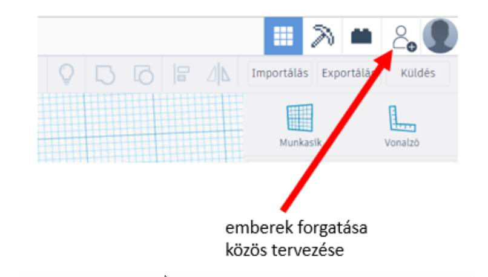
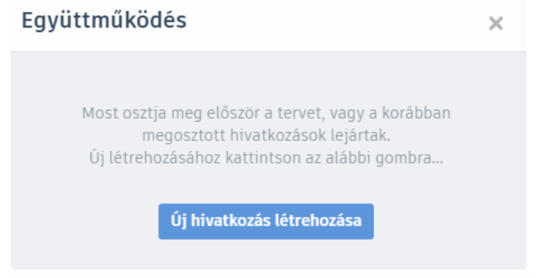
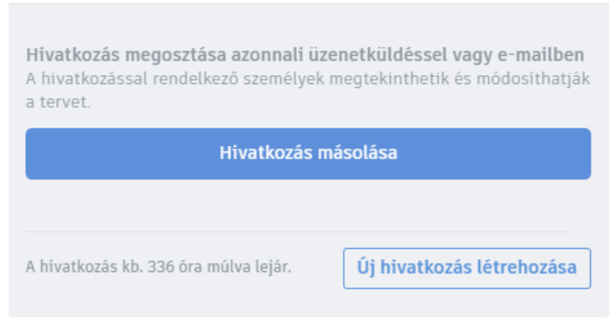
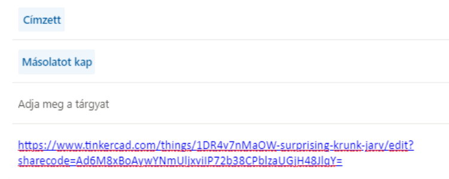

# 🤝 Kollaboráció Tinkercadben

  

    TINKERCAD · EGYÜTTMŰKÖDÉS
    <h2>Dolgozzatok közösen ugyanazon a modellen!</h2>
    
A Tinkercadben egy tervhez másokat is meghívhatsz. Így többen dolgozhattok ugyanazon a modellen, de ehhez érdemes előre megbeszélni, ki melyik részen dolgozik.

  

  
🤝

  ⏱️ 3–5 perc
  🎯 Közös szerkesztés
  👥 Pár- és csoportmunkához

## Meghívás a közös tervbe

  
1
<strong>Nyisd meg azt a tervet, amelyen közösen szeretnétek dolgozni!</strong>A meghívást abból a tervből indítsd, amelyet meg szeretnél osztani a társaddal vagy a csoportoddal.

<figure class="tool-figure tool-figure--wide">
  
  <figcaption>A közös munkához először indítsd el a meghívást a megnyitott tervből.</figcaption>
</figure>

  
2
<strong>Hozd létre a meghívó hivatkozást!</strong>A Tinkercad egy olyan hivatkozást készít, amelyet el tudsz küldeni annak, akivel együtt szeretnél dolgozni.

<figure class="tool-figure tool-figure--wide">
  
  <figcaption>A közös szerkesztéshez létrehozhatsz egy meghívó hivatkozást.</figcaption>
</figure>

  
3
<strong>Másold ki a hivatkozást!</strong>A másolt linket ezután elküldheted a társadnak a tanár által megadott kommunikációs felületen.

<figure class="tool-figure tool-figure--wide">
  
  <figcaption>Másold ki a meghívó hivatkozást, majd csak annak küldd el, akivel közösen dolgozol.</figcaption>
</figure>

  
4
<strong>Küldd el a meghívót a társadnak!</strong>A meghívott tanuló a hivatkozás megnyitásával tud csatlakozni a közös tervhez.

<figure class="tool-figure tool-figure--wide">
  
  <figcaption>A link elküldése után a társad csatlakozhat a közös munkához.</figcaption>
</figure>

!!! warning "A meghívó hivatkozást kezeld úgy, mint egy belépőt!"
    Ne tedd közzé nyilvánosan, és ne küldd tovább olyanoknak, akik nem vesznek részt a közös munkában.

## Hogyan dolgozzatok úgy, hogy ne zavarjátok egymást?

A közös szerkesztés akkor működik jól, ha nem egyszerre próbáltok ugyanazon a kis részleten változtatni. Mielőtt elkezditek a munkát, beszéljétek meg a feladatokat!

  
🧩<strong>Osszátok fel a modellt!</strong>Például egyikőtök készítse az alapot, a másik a feliratot vagy a díszítőelemeket.

  
🗣️<strong>Szóljatok egymásnak!</strong>Ha átalakítotok vagy töröltök valamit, amit a másik készített, előtte egyeztessetek.

  
👀<strong>Ellenőrizzétek együtt!</strong>A végén nézzétek végig a teljes modellt, ne csak a saját részeteket.

  
🎯<strong>Legyen közös cél!</strong>Nem az a lényeg, hogy ki hány elemet készített, hanem hogy a végső modell működjön.

  <strong>Közös modell ≠ összevissza szerkesztés</strong>
  A kollaboráció nem attól lesz hatékony, hogy mindenki egyszerre mindent módosít. A jó közös munka alapja a feladatok felosztása és az egyeztetés.

## Gyors ellenőrzés

  <label><input type="checkbox">A megfelelő tervből indítottam a meghívást.</label>
  <label><input type="checkbox">A meghívó hivatkozást csak annak küldtem el, akivel együtt dolgozom.</label>
  <label><input type="checkbox">Megbeszéltük, ki melyik részen dolgozik.</label>
  <label><input type="checkbox">Nem módosítom vagy törlöm a társam munkáját egyeztetés nélkül.</label>
  <label><input type="checkbox">A végén közösen ellenőrizzük a teljes modellt.</label>

## Kapcsolódó segítség

  <a href="../csoportositas/">
    🧩
    <strong>Csoportosítás és szétbontás</strong><small>Ha a közösen elkészített elemeket egy egységgé szeretnétek rendezni.</small>
  </a>
  <a href="../masolas-ismetles/">
    📑
    <strong>Másolás és ismétlés</strong><small>Ha egyikőtök elkészít egy elemet, amelyből több példányra is szükség van.</small>
  </a>

<a href="../">← Vissza a Tinkercad eszköztárhoz</a>

