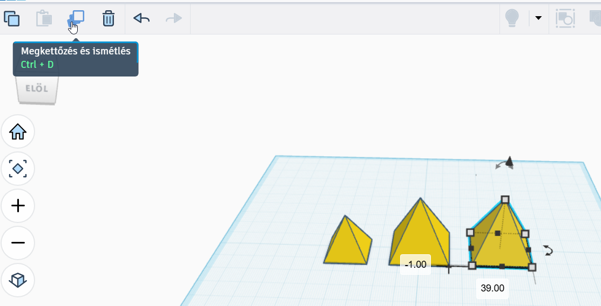
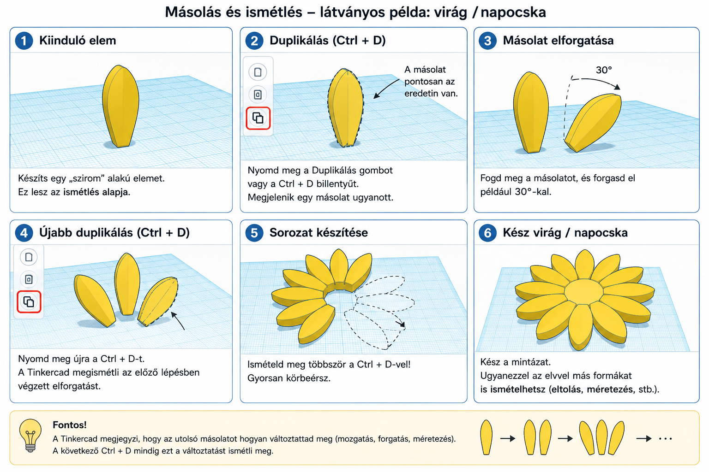

# 📑 Másolás és ismétlés

  

    TINKERCAD · HATÉKONY MUNKA
    <h2>Ne építsd meg ugyanazt újra!</h2>
    
Ha több egyforma vagy szabályosan ismétlődő elemre van szükséged, nem kell mindegyiket külön elkészítened. A <strong>Duplikálás / Duplicate</strong> másolatot készít, az ismétlés pedig az előző változtatást is újra végrehajthatja.

  

  
📑

  ⏱️ 3–5 perc
  📋 Duplikálás
  🔁 Sorozatok és mintázatok

## Egy elem lemásolása

  
1
<strong>Jelöld ki a másolni kívánt elemet!</strong>Ez lehet egyetlen alakzat vagy akár egy már csoportosított összetett elem is.

  
2
<strong>Duplikáld!</strong>Kattints a <strong>Duplikálás / Duplicate</strong> gombra, vagy használd a <strong>Ctrl + D</strong> billentyűkombinációt.

<figure class="tool-figure tool-figure--wide">
  
  <figcaption>A kijelölt elemről a Duplikálás gombbal vagy a Ctrl + D billentyűkkel készíthetsz másolatot.</figcaption>
</figure>

!!! info "Hová került a másolat?"
    A másolat először **pontosan az eredeti helyén** jön létre, ezért úgy tűnhet, mintha semmi sem történt volna. A kijelölt új példányt mozdítsd el, és máris láthatóvá válik!

## Az igazi trükk: ismételd meg a változtatást!

A duplikálás nemcsak arra jó, hogy sok egyforma elemet készíts. A Tinkercad azt is meg tudja ismételni, **amit az első másolattal a duplikálás után csináltál**.

  
3
<strong>Változtasd meg az első másolatot!</strong>Például mozdítsd el, forgasd el vagy méretezd át.

  
4
<strong>Nyomd meg újra a Ctrl + D-t!</strong>Újabb másolat készül, és a Tinkercad megismétli az előző példányon végzett változtatást.

  
5
<strong>Ismételd tovább!</strong>Minden újabb Ctrl + D folytatja ugyanazt a változtatási sort.

  <strong>Elsőként próbálj ki egy egyszerű sort!</strong>
  Duplikálj egy elemet, mozdítsd el például mindig ugyanannyival jobbra, majd nyomd meg többször a <strong>Ctrl + D</strong>-t! Így biztosan jól látszik az ismétlés működése.

<figure class="tool-figure tool-figure--wide">
  
  <figcaption>A kép egy körkörös ismétlés <strong>elvét</strong> mutatja. Ehhez a forgás középpontját külön is meg kell tervezni; egy önálló szirom egyszerű elforgatása csak a saját közepe körül fordítja el az elemet.</figcaption>
</figure>

!!! warning "A körkörös minta egy lépéssel összetettebb"
    Ha például virágot vagy napocskát szeretnél készíteni, nem elég egyetlen szirmot duplikálni és elforgatni: az elem önmagában a **saját közepe körül** fordul el. Körkörös elrendezéshez olyan kijelölést vagy ideiglenes segédelemet kell kialakítanod, amelynek középpontja a kívánt forgásközéppontban van. Ezt inkább haladó mintakészítésnél használd!

  <strong>A lényeg egy sorban</strong>
  <strong>Duplikálás → változtatás → újabb duplikálás → ugyanaz a változtatás ismétlődik.</strong>

## Mit lehet így ismételni?

  
↔️<strong>Eltolást</strong>Egyenletes távolságú sorokhoz, például oszlopokhoz vagy bordákhoz.

  
🔄<strong>Forgatást</strong>Azonos szögelfordulás ismétléséhez. Körkörös elrendezéshez a forgás középpontját is megfelelően kell kialakítani.

  
📐<strong>Méretezést</strong>Fokozatosan növekvő vagy csökkenő elemekhez.

  
🧩<strong>Több változtatást együtt</strong>Összetettebb sorozatokhoz, ha az első másolaton több műveletet is végzel.

!!! tip "Először csak az első másolatot állítsd be!"
    Szabályos sorozatnál ne helyezgesd kézzel az összes példányt. Készíts egy másolatot, állítsd be pontosan a kívánt eltolást vagy más változtatást, és csak ezután ismételd a Ctrl + D-t!

!!! warning "Ha közben mást csinálsz"
    Az ismétlés az előző duplikáláshoz kapcsolódó változtatást követi. Ha megszakítod a műveletsort vagy más elemet kezdesz szerkeszteni, ne számíts arra, hogy később ugyanonnan automatikusan folytatja a mintát.

## Gyors ellenőrzés

  <label><input type="checkbox">Tudok másolatot készíteni a Duplikálás gombbal vagy Ctrl + D-vel.</label>
  <label><input type="checkbox">Tudom, hogy az új másolat először az eredeti helyén jelenik meg.</label>
  <label><input type="checkbox">Értem a duplikálás → változtatás → újabb duplikálás sorrendet.</label>
  <label><input type="checkbox">Tudok egyenletes sort készíteni ismételt duplikálással.</label>
  <label><input type="checkbox">Tudom, hogy a körkörös minta külön forgásközéppontot igényel.</label>

## Kapcsolódó segítség

  <a href="../gyors-szerkesztes/">
    ↩️
    <strong>Visszavonás és gyors szerkesztés</strong><small>Ha a másolás, kijelölés vagy gyorsbillentyűk alapjait keresed.</small>
  </a>
  <a href="../mozgas-forgatas-emeles/">
    🔄
    <strong>Mozgatás, forgatás és emelés</strong><small>Az első másolat helyzetének pontos beállításához.</small>
  </a>
  <a href="../meretezes/">
    📏
    <strong>Méretezés és igazítás</strong><small>Ha az ismétlődő elemek méretét vagy helyzetét is pontosan szeretnéd beállítani.</small>
  </a>

<a href="../">← Vissza a Tinkercad eszköztárhoz</a>

