# 📏 Méretezés és igazítás

  

    TINKERCAD · ALAPMŰVELET
    <h2>Ne csak szemre dolgozz!</h2>
    
A 3D nyomtatásnál a méret nem csak látvány. Egy tartó, furat vagy illeszkedő rész csak akkor működik jól, ha pontosan méretezed és rendezetten igazítod az elemeket.

  

  
📏

  ⏱️ 5–8 perc
  🎯 Pontos méretezés
  🧩 Illeszkedő elemekhez különösen fontos

## Pontos méret megadása

  
1
<strong>Jelöld ki az alakzatot!</strong>A kijelölt test körül megjelennek a méretező fogópontok és a méretértékek.

<figure class="tool-figure tool-figure--wide">
  <a href="../../../images/eszkoztar/tinkercad/meretezes/01-meret-kijelolo.png" target="_blank">
    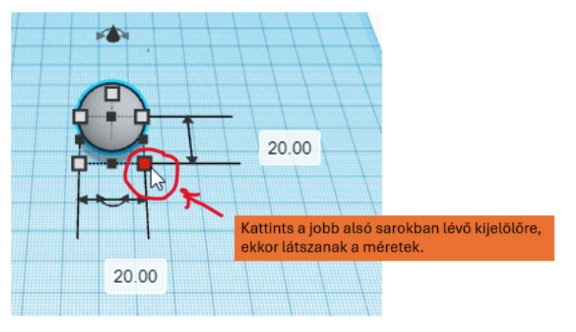
  </a>
  <figcaption>A kijelölt alakzatnál közvetlenül megadhatod a kívánt méretet.</figcaption>
</figure>

  
2
<strong>Add meg számmal a szükséges méreteket!</strong>Ha a feladatodhoz milliméterben mért adat tartozik, kattints a méretértékre és írd be pontosan a kívánt számot.

<figure class="tool-figure tool-figure--wide">
  <a href="../../../images/eszkoztar/tinkercad/meretezes/02-magassag-szelesseg-melyseg.png" target="_blank">
    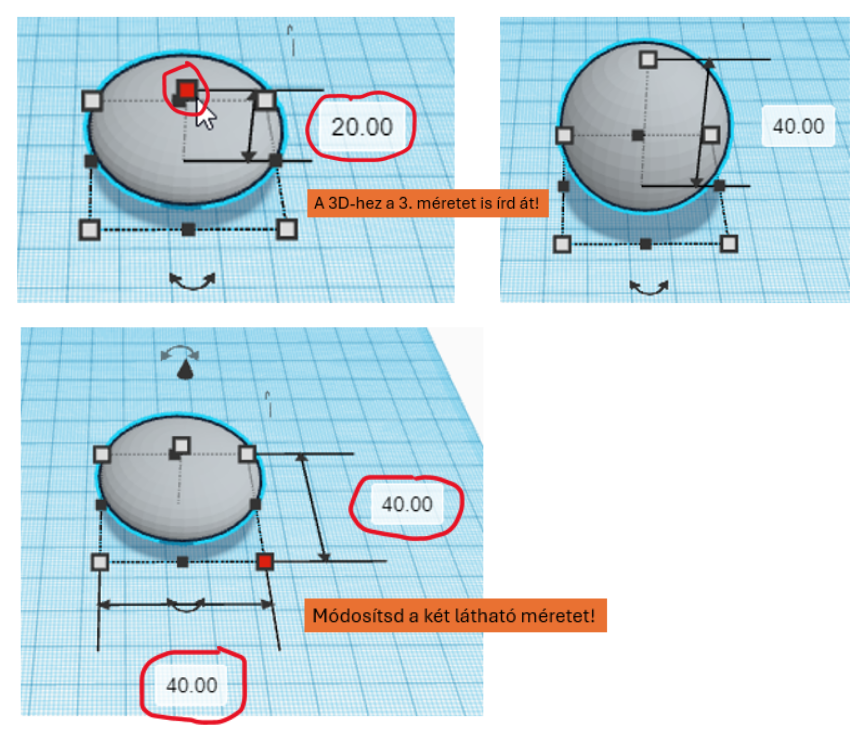
  </a>
  <figcaption>A három térbeli kiterjedést külön is beállíthatod: szélesség, mélység és magasság.</figcaption>
</figure>

!!! tip "Használd a tervet!"
    Tartsd magad mellett a méretezett vázlatodat, és a fontos méreteket abból vidd át a modellbe. A funkcionális részeknél ne szemre dolgozz!

## Igazítás – több lépésben

Az **Igazítás / Align** akkor hasznos, amikor több alakzatnak pontosan kell egymáshoz viszonyulnia. Kézi tologatással könnyű néhány millimétert tévedni; az igazítási pontokkal viszont pontosan megadhatod, melyik szélek vagy középvonalak kerüljenek egy vonalba.

  
3
<strong>Jelöld ki együtt az igazítandó alakzatokat!</strong>Ehhez mindkét – vagy akár több – testnek egyszerre kijelölve kell lennie.

<figure class="tool-figure tool-figure--medium">
  <a href="../../../images/eszkoztar/tinkercad/meretezes/03-illesztes.png" target="_blank">
    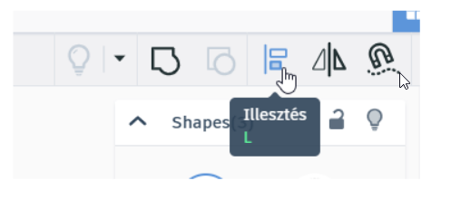
  </a>
  <figcaption>Az igazításhoz először együtt kell kijelölni az elemeket.</figcaption>
</figure>

  
4
<strong>Kapcsold be az Igazítás / Align műveletet!</strong>A kijelölt alakzatok körül megjelennek az igazítási jelölők. Ezek mutatják, milyen irányokban tudod egymáshoz rendezni az elemeket.

<figure class="tool-figure tool-figure--wide">
  <a href="../../../images/eszkoztar/tinkercad/meretezes/05-jelolok.png" target="_blank">
    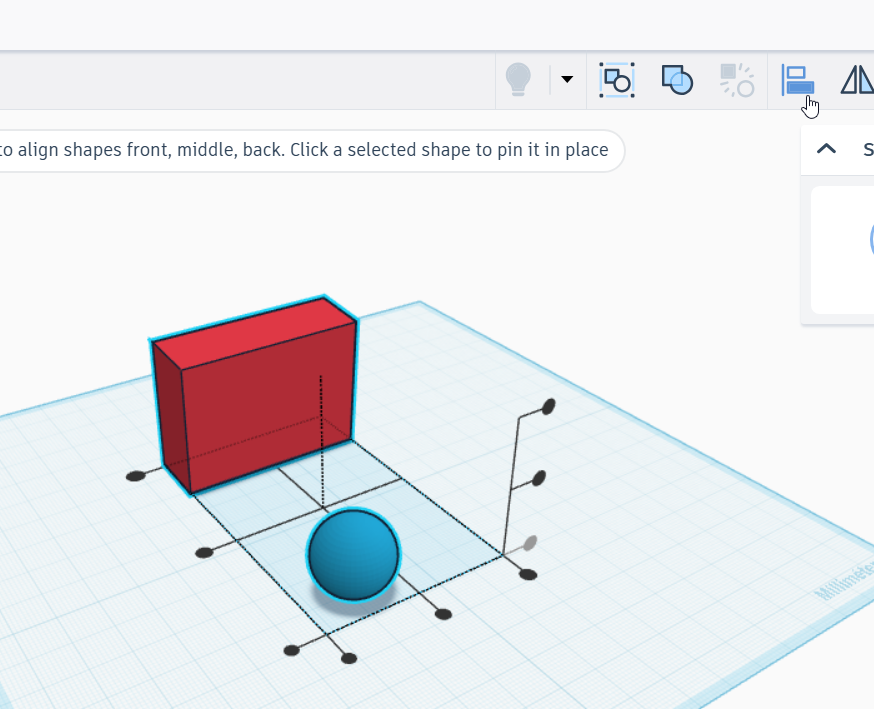
  </a>
  <figcaption>Az igazítási jelölők közül választhatod ki, hogy melyik szélek vagy középvonalak kerüljenek egy vonalba.</figcaption>
</figure>

  <strong>Mit jelentenek a jelölők?</strong>
  Egy irányban általában három lehetőség közül választhatsz: az egyik szélhez, középre vagy a másik szélhez igazítás. A megfelelő pont fölé húzva az egeret előnézetet kapsz, kattintás után pedig az elemek a kiválasztott helyzetbe rendeződnek.

### Első igazítási példa

  
5
<strong>Válassz egy igazítási pontot!</strong>Kattints arra a jelölőre, amelyik a kívánt elrendezést adja.

<figure class="tool-figure tool-figure--wide">
  <a href="../../../images/eszkoztar/tinkercad/meretezes/06-igazitas1.png" target="_blank">
    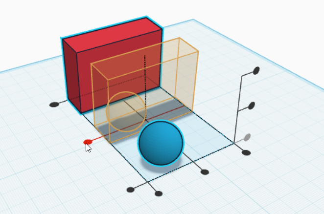
  </a>
  <figcaption>Az egyik igazítási irány kiválasztása.</figcaption>
</figure>

<figure class="tool-figure tool-figure--wide">
  <a href="../../../images/eszkoztar/tinkercad/meretezes/07-igazitas1-eredmeny.png" target="_blank">
    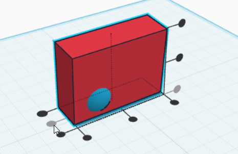
  </a>
  <figcaption>Az első igazítás után az elemek az adott irányban pontosan rendeződnek.</figcaption>
</figure>

### Második irány igazítása

  
6
<strong>Ha szükséges, igazíts egy másik irányban is!</strong>Egyetlen kattintás nem feltétlenül rendezi minden tengely mentén az elemeket. Másik jelölővel egy újabb irányban is pontosíthatod a helyzetüket.

<figure class="tool-figure tool-figure--wide">
  <a href="../../../images/eszkoztar/tinkercad/meretezes/08-igazitas2.png" target="_blank">
    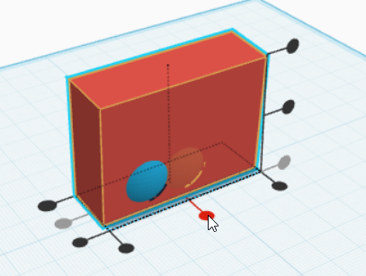
  </a>
  <figcaption>Az elemek egy másik irányban is egymáshoz igazíthatók.</figcaption>
</figure>

<figure class="tool-figure tool-figure--wide">
  <a href="../../../images/eszkoztar/tinkercad/meretezes/09-igazitas2-eredmeny.png" target="_blank">
    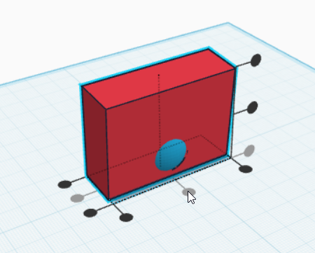
  </a>
  <figcaption>A második igazítás után már két irányban is pontos a helyzet.</figcaption>
</figure>

### Harmadik irány és finomhangolás

  
7
<strong>Szükség esetén a harmadik térbeli irányban is igazíts!</strong>3D-ben nemcsak jobbra–balra és előre–hátra, hanem függőleges irányban is fontos lehet a pontos helyzet.

<figure class="tool-figure tool-figure--wide">
  <a href="../../../images/eszkoztar/tinkercad/meretezes/10-igazitas3.png" target="_blank">
    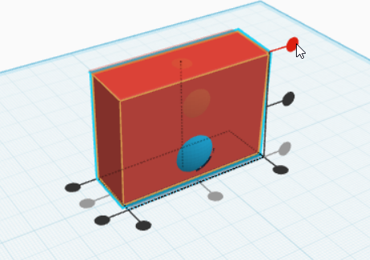
  </a>
  <figcaption>Az igazítás a tér harmadik irányában is használható.</figcaption>
</figure>

  
8
<strong>Ha nem középre vagy szélre kell kerülnie, finomíts kézzel!</strong>Az Igazítás nagyon pontos kiindulópontot ad, de nem minden feladatban a közép vagy valamelyik szél a cél. Ilyenkor igazítás után kézzel vagy pontos mozgatással állítsd be a végleges helyzetet.

<figure class="tool-figure tool-figure--wide">
  <a href="../../../images/eszkoztar/tinkercad/meretezes/11-kezi-igazitas.png" target="_blank">
    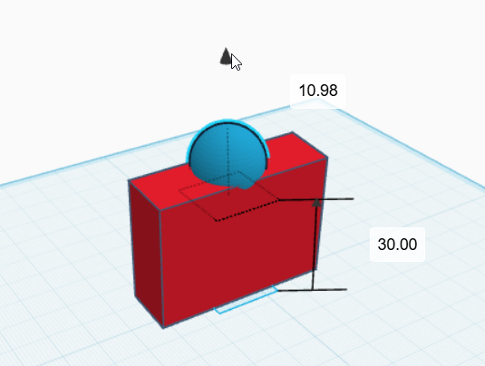
  </a>
  <figcaption>Az automatikus igazítás után szükség esetén kézzel is finomíthatod a helyzetet.</figcaption>
</figure>

  
9
<strong>Ellenőrizd több nézetből az eredményt!</strong>Forgasd körbe a modellt, mert egyetlen nézet könnyen megtévesztő lehet.

<figure class="tool-figure tool-figure--medium">
  <a href="../../../images/eszkoztar/tinkercad/meretezes/04-illesztes-eredmenye.png" target="_blank">
    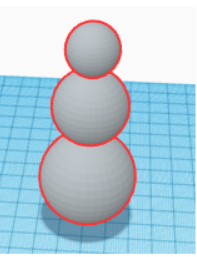
  </a>
  <figcaption>Az igazítás után mindig ellenőrizd, hogy valóban azt az elrendezést kaptad-e, amit terveztél.</figcaption>
</figure>

## Mire használhatod az igazítást?

  
🎯<strong>Középre igazítás</strong>Két vagy több elem középvonalának pontos egyeztetéséhez.

  
🕳️<strong>Furat elhelyezése</strong>Ha a nyílásnak pontosan középen vagy meghatározott vonalban kell lennie.

  
🧩<strong>Illesztés</strong>Egymáshoz kapcsolódó alkatrészek rendezett elhelyezéséhez.

  
⚖️<strong>Szimmetria</strong>Rendezett, kiegyensúlyozott szerkezet kialakításához.

!!! tip "Az igazítás nem egyetlen művelet"
    Egy összetett 3D modellnél gyakran több irányban, egymás után kell igazítanod. Mindig azt nézd, hogy **melyik irányban** szeretnéd pontosan elhelyezni az elemeket!

!!! warning "A képernyő becsaphat"
    Egy tárgy lehet látványra megfelelő, miközben a valóságban túl kicsi, túl nagy vagy rosszul illeszkedik. A fontos méreteket mindig számmal ellenőrizd!

## Gyors ellenőrzés

  <label><input type="checkbox">A fontos méreteket számmal adtam meg, nem csak szemre állítottam.</label>
  <label><input type="checkbox">Ellenőriztem a szélességet, mélységet és magasságot.</label>
  <label><input type="checkbox">Az igazítandó elemeket együtt jelöltem ki.</label>
  <label><input type="checkbox">Átgondoltam, melyik irányban kell középre vagy szélre igazítani őket.</label>
  <label><input type="checkbox">Ha több irányban is pontos helyzet kellett, az igazítást több lépésben végeztem el.</label>
  <label><input type="checkbox">Az eredményt több nézetből is ellenőriztem.</label>

## Kapcsolódó segítség

  <a href="../mozgas-forgatas-emeles/">
    🔄
    <strong>Mozgatás, forgatás és emelés</strong><small>Ha az elemek térbeli helyzetét is pontosítani szeretnéd.</small>
  </a>
  <a href="../furat/">
    🕳️
    <strong>Furat készítése</strong><small>Ha a pontos méretet kivágásnál szeretnéd használni.</small>
  </a>

<a href="../">← Vissza a Tinkercad eszköztárhoz</a>

