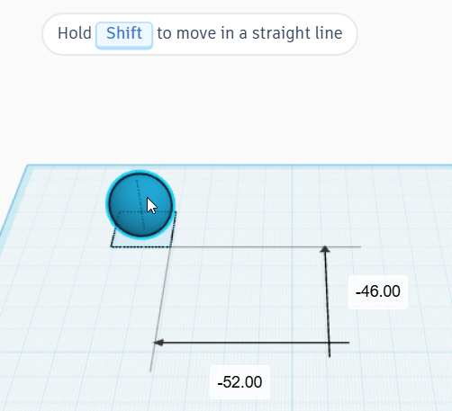
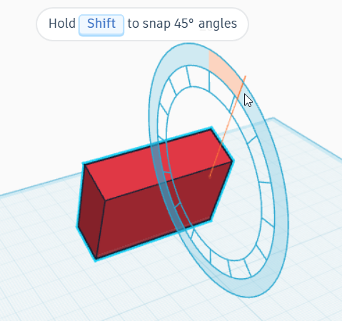
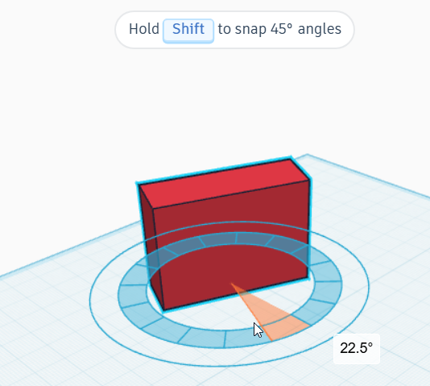
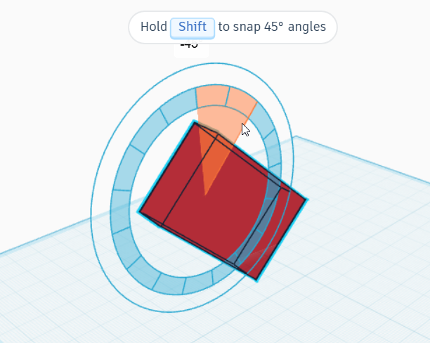
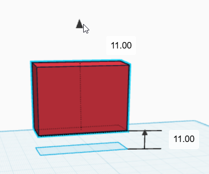
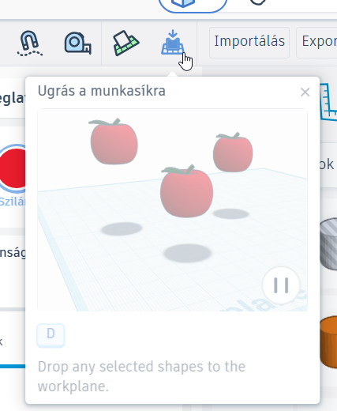
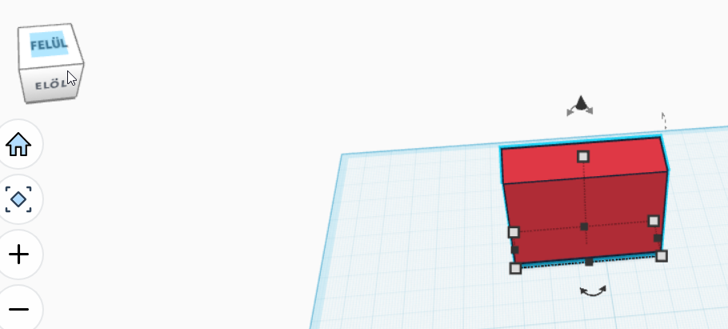

# 🔄 Mozgatás, forgatás és emelés

  

    TINKERCAD · ALAPMŰVELET
    <h2>Helyezd pontosan oda, ahová szeretnéd!</h2>
    
Egy alakzatot nemcsak arrébb tehetsz: el is forgathatod, felemelheted a munkasíkról, majd több nézetből ellenőrizheted a helyzetét.

  

  
🔄

  ⏱️ 4–7 perc
  🎯 Alapművelet
  📦 Térbeli elhelyezés

  <strong>Mire jó?</strong>
  A modellezés során gyakran kell egy elemet pontos helyre tenni, más irányba fordítani vagy a munkasík fölé emelni. Ezek együtt adják a valódi térbeli elhelyezést.

## 1. Mozgatás a munkasíkon

Jelöld ki az alakzatot, majd húzd a kívánt helyre! Ilyenkor az elem a munkasíkkal párhuzamosan mozog.

<figure class="tool-figure tool-figure--wide">
  
  <figcaption>Az alakzatot egyszerű húzással helyezheted át a munkasíkon.</figcaption>
</figure>

!!! tip "Pontos mozgatás"
    Ha csak kicsit szeretnéd arrébb tenni az alakzatot, kijelölés után a billentyűzet nyílbillentyűivel is mozgathatod.

## 2. Forgatás

Kijelölés után az alakzat körül megjelenő íves forgatófogantyúkkal három különböző irányban forgathatsz.

<figure class="tool-figure tool-figure--wide">
  
  <figcaption>Fogd meg a megfelelő forgatóívet, és húzd a kívánt irányba!</figcaption>
</figure>

<figure class="tool-figure tool-figure--medium">
  
  <figcaption>Ugyanaz az alakzat másik forgatási irányban.</figcaption>
</figure>

<figure class="tool-figure tool-figure--medium">
  
  <figcaption>A harmadik forgatási irány is külön fogantyúval érhető el.</figcaption>
</figure>

### Mit jelent az X, Y és Z irány?

A 3D térben három egymásra merőleges tengellyel írjuk le a helyzetet:

  
↔️<strong>X tengely</strong>Az egyik vízszintes irány a munkasík síkjában.

  
↕️<strong>Y tengely</strong>A másik vízszintes irány, szintén a munkasík síkjában.

  
⬆️<strong>Z tengely</strong>A függőleges irány: ettől kerül valami magasabbra vagy alacsonyabbra.

Forgatásnál mindig **valamelyik tengely körül** fordítjuk el az alakzatot:

- ha az alakzat a munkasíkon „körbefordul”, akkor a függőleges **Z tengely körül** forog;
- ha előre–hátra vagy oldalra billen, akkor valamelyik vízszintes, **X vagy Y tengely körül** forog.

!!! info "Nem kell a képernyőn bemagolni, melyik ív az X vagy az Y"
    A nézet forgatása miatt könnyű összekeverni őket. Fontosabb azt felismerni, hogy **milyen tengely körül szeretnéd elfordítani a tárgyat**: vízszintesen körbeforgatni, vagy valamelyik oldalára billenteni.

## 3. Felemelés a munkasíkról

A fekete, kúpszerű fogantyúval az alakzatot függőlegesen, vagyis a **Z irányban** mozgathatod.

<figure class="tool-figure tool-figure--medium">
  
  <figcaption>A fekete fogantyúval állíthatod be, milyen magasan legyen az alakzat a munkasík fölött.</figcaption>
</figure>

## 4. Vissza a munkasíkra

Ha egy elem véletlenül vagy szándékosan a munkasík fölé került, gyorsan visszahelyezheted a munkasíkra.

<figure class="tool-figure tool-figure--medium">
  
  <figcaption>A munkasíkra helyezés akkor különösen hasznos, ha az elemnek pontosan a talajon kell állnia.</figcaption>
</figure>

## 5. Ellenőrizd térben!

A képernyőn egyetlen nézet könnyen megtévesztő lehet. Forgasd körbe a kamerát, és több oldalról is ellenőrizd, hogy az elemek valóban ott vannak-e, ahol szeretnéd!

<figure class="tool-figure tool-figure--wide">
  
  <figcaption>Forgasd körbe a nézetet, és ellenőrizd a magasságot, az irányt és az illeszkedést is.</figcaption>
</figure>

## Gyors ellenőrzés

  <label><input type="checkbox">Az alakzatot a megfelelő helyre mozgattam.</label>
  <label><input type="checkbox">A megfelelő irányba forgattam.</label>
  <label><input type="checkbox">Ha felemeltem, ellenőriztem a magasságát.</label>
  <label><input type="checkbox">Több nézetből is megnéztem az eredményt.</label>

!!! warning "Gyakori hiba"
    Két elem egy nézetből úgy tűnhet, mintha összeérne, miközben valójában eltérő magasságban vannak. Mozgatás és forgatás után mindig ellenőrizd a modellt több irányból!

## Kapcsolódó segítség

  <a href="../navigacio/">
    🧭
    <strong>Navigáció</strong><small>Ha több nézetből szeretnéd ellenőrizni a modellt.</small>
  </a>
  <a href="../meretezes/">
    📏
    <strong>Méretezés és igazítás</strong><small>Ha a pontos helyzet mellett pontos méretre is szükséged van.</small>
  </a>

<a href="../">← Vissza a Tinkercad eszköztárhoz</a>

