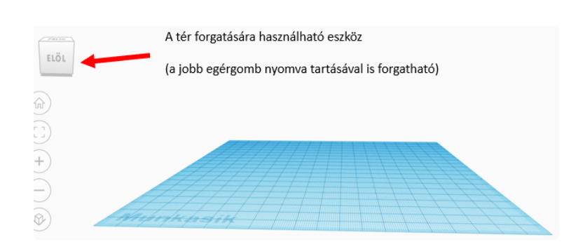
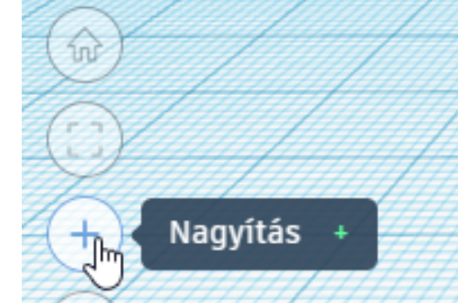
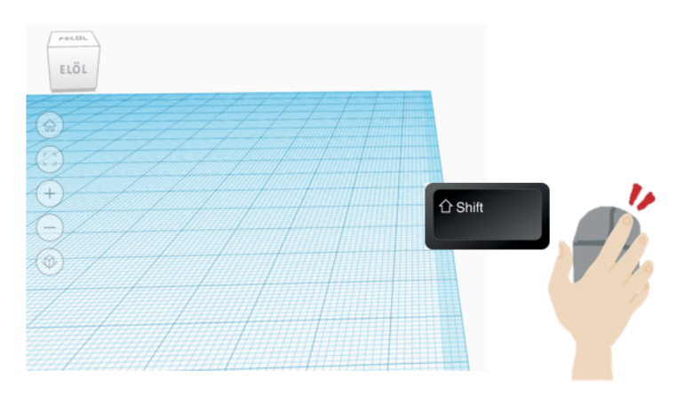

# 🧭 Navigáció a Tinkercad 3D térben

  

    TINKERCAD · KEZDÉS
    <h2>Mozogj magabiztosan a 3D térben!</h2>
    
A modelledet nem elég egyetlen irányból nézni. Tanuld meg <strong>forgatni a nézetet</strong>, <strong>nagyítani és kicsinyíteni</strong>, valamint <strong>eltolni a munkaterületet</strong>!

  

  
🧭

  👀 kezdőknek
  ⏱️ 3–5 perc
  🖱️ nézet és munkaterület

  <strong>Mire jó?</strong>
  A Tinkercadben könnyű úgy elhelyezni két alakzatot, hogy egy nézetből jónak tűnjenek, közben valójában nem érnek össze vagy rossz magasságban vannak. Ezért modellezés közben rendszeresen nézd meg a tárgyat több irányból!

## 1. Forgasd el a nézetet!

A bal felső sarokban lévő **nézetkockával** más irányból nézheted meg a 3D teret. A kockát egérrel húzva szabadon forgathatod a nézetet.

A nézetet a **jobb egérgomb nyomva tartásával és az egér mozgatásával** is forgathatod.

<figure class="tool-figure tool-figure--wide">
  
  <figcaption>A nézetkockával vagy a jobb egérgombbal körbeforgathatod a 3D teret.</figcaption>
</figure>

!!! tip "Nézd meg több oldalról!"
    Ne csak akkor forgasd körbe a modelledet, amikor elkészültél! Munka közben is ellenőrizd elölről, oldalról és felülről!

## 2. Nagyíts és kicsinyíts!

Ha egy részletet szeretnél pontosan megnézni, nagyíts rá! Ha az egész modellt szeretnéd átlátni, kicsinyíts!

Használhatod:

- a **+** és **−** ikonokat;
- vagy az **egérgörgőt**.

<figure class="tool-figure tool-figure--medium">
  
  <figcaption>A <strong>+</strong> és <strong>−</strong> ikonokkal, illetve az egérgörgővel változtathatod a nagyítást.</figcaption>
</figure>

  <strong>Mikor melyiket?</strong>
  <strong>Nagyíts</strong>, ha méretet, illeszkedést vagy apró részletet ellenőrzöl. <strong>Kicsinyíts</strong>, ha azt szeretnéd látni, hogyan helyezkedik el az egész modell a munkaterületen.

## 3. Told el a munkaterületet!

Előfordulhat, hogy jó a nagyítás és a nézet iránya, csak a modell nincs kényelmes helyen a képernyőn. Ilyenkor nem kell elforgatni: egyszerűen **told el a munkaterületet**!

Tartsd lenyomva a **Shift** billentyűt, közben tartsd nyomva a **jobb egérgombot**, és mozgasd az egeret!

<figure class="tool-figure tool-figure--wide">
  
  <figcaption><strong>Shift + jobb egérgomb + egérmozgatás</strong>: a munkaterület eltolása anélkül, hogy elforgatnád a nézetet.</figcaption>
</figure>

## Mikor van erre különösen szükséged?

  
🧩<strong>Illesztés</strong>Amikor két elemnek pontosan össze kell érnie.

  
🕳️<strong>Furat</strong>Amikor ellenőrizned kell, hogy a kivágó alakzat valóban átfedi-e a testet.

  
📏<strong>Pontos elhelyezés</strong>Amikor nemcsak szemre szeretnéd megítélni a tárgy helyzetét.

  
🖨️<strong>Nyomtathatóság</strong>Amikor azt nézed, stabilan áll-e a modell és nincs-e rejtett hiba.

## Próbáld ki!

  <label><input type="checkbox">Körbeforgattam a 3D teret több irányba.</label>
  <label><input type="checkbox">Nagyítottam és kicsinyítettem a nézetet.</label>
  <label><input type="checkbox">Shift + jobb egérgomb használatával eltolottam a munkaterületet.</label>
  <label><input type="checkbox">Beállítottam egy olyan nézetet, amelyben jól átlátom a teljes teret.</label>

!!! note "A jelölések nem mentődnek"
    A pipák csak ezen az oldalon látszanak. Az oldal bezárása után nem maradnak meg.

## Kapcsolódó segítség

  <a href="../uj-terv/">
    🆕
    <strong>Új 3D terv létrehozása</strong><small>Ha még el kell indítanod a saját tervedet.</small>
  </a>
  <a href="../furat/">
    🕳️
    <strong>Furat készítése</strong><small>Ha több nézetből szeretnéd ellenőrizni a kivágást.</small>
  </a>

<a href="../">← Vissza a Tinkercad eszköztárhoz</a>

