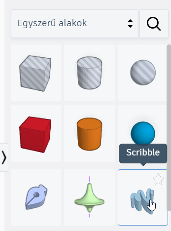
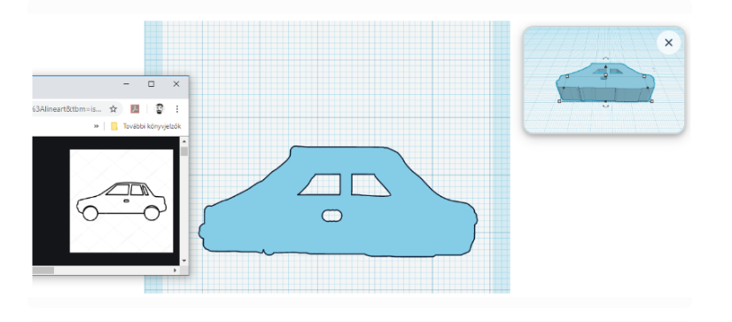
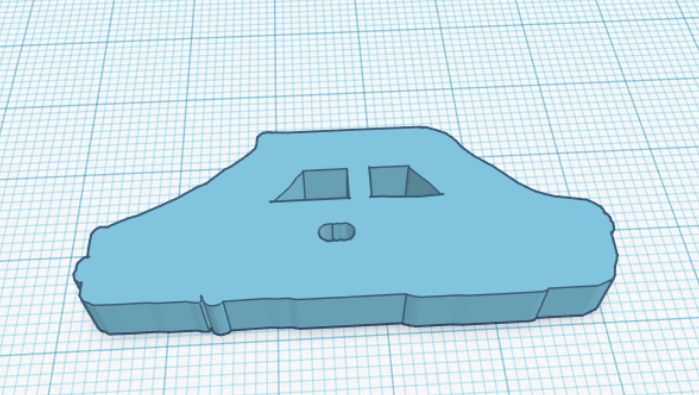
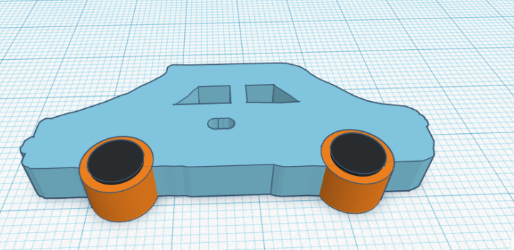
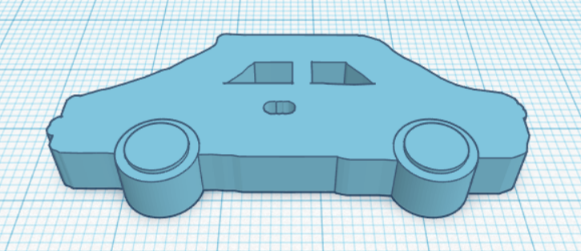

# ✏️ Szabadkézi rajzolás – Scribble

  

    TINKERCAD · ALAKÍTÁS
    <h2>Rajzolj saját formát szabad kézzel!</h2>
    
A <strong>Scribble</strong> eszközzel olyan egyedi alakzatot készíthetsz, amelyet nehéz lenne egyszerű alapformákból összeépíteni.

  

  
✏️

  ⏱️ 3–5 perc
  🎯 Egyedi forma készítése
  🧩 Más alakzatokkal is kombinálható

## Lépésről lépésre

  
1
<strong>Válaszd a Szabadkéz / Scribble alakzatot!</strong>Húzd a munkasíkra ugyanúgy, mint bármely más alapformát.

<figure class="tool-figure tool-figure--wide">
  
  <figcaption>A Scribble saját rajzból készít 3D-s alakzatot.</figcaption>
</figure>

  
2
<strong>Rajzold meg a kívánt körvonalat!</strong>A megnyíló rajzfelületen az egérrel készítheted el a saját formádat. Törekedj egyszerű, jól záródó alakzatra!

<figure class="tool-figure tool-figure--wide">
  
  <figcaption>A rajzod körvonala lesz a létrejövő 3D-s test alapja.</figcaption>
</figure>

!!! tip "Nem kell elsőre tökéletesnek lennie"
    A Scribble inkább gyors, egyedi formákhoz való, mint milliméterpontos műszaki rajzhoz. Ha a rajz nem sikerül, javítsd vagy vond vissza az utolsó lépést a <strong>Ctrl + Z</strong> billentyűkombinációval!

  
3
<strong>Fejezd be a rajzolást!</strong>A Tinkercad a síkbeli rajzból térbeli alakzatot készít, amelyet ezután ugyanúgy mozgathatsz, forgathatsz és méretezhetsz, mint a többi testet.

<figure class="tool-figure tool-figure--wide">
  
  <figcaption>A kész Scribble már normál 3D-s alakzatként szerkeszthető tovább.</figcaption>
</figure>

## Egészítsd ki más alakzatokkal!

A szabadkézi forma nem kell, hogy önmagában maradjon. Egyszerű alaptestekkel kiegészítve pontosabb vagy használhatóbb modellt készíthetsz belőle.

<figure class="tool-figure tool-figure--wide">
  
  <figcaption>A saját rajzot alapformákkal is továbbépítheted.</figcaption>
</figure>

  
4
<strong>Ha az elemek már összetartoznak, csoportosítsd őket!</strong>Így a különálló részekből egy együtt kezelhető összetett forma lesz.

<figure class="tool-figure tool-figure--wide">
  
  <figcaption>Az egyedi forma más elemekkel együtt is csoportosítható.</figcaption>
</figure>

## Mikor érdemes Scribble-t használni?

  
🍃<strong>Szabálytalan körvonal</strong>Levél, felhő, folt vagy más organikus forma készítéséhez.

  
🎨<strong>Díszítőelem</strong>Egyedi jel, motívum vagy dekoráció kialakításához.

  
🧩<strong>Kiegészítő forma</strong>Ha az alapformákból hiányzik egy speciális rész.

  
💡<strong>Gyors prototípus</strong>Ha először csak az ötlet alakját szeretnéd gyorsan kipróbálni.

!!! warning "Ne használd mindenre!"
    Ha pontos geometriai méret, szabályos kör, téglalap vagy más egyszerű alakzat kell, általában jobb a kész alapformákból kiindulni. A Scribble ereje az egyedi, szabálytalan formákban van.

## Gyors ellenőrzés

  <label><input type="checkbox">A Scribble-t akkor választottam, amikor valóban egyedi formára volt szükségem.</label>
  <label><input type="checkbox">A rajzom egyszerű, felismerhető és jól használható körvonalat ad.</label>
  <label><input type="checkbox">A kész alakzat méretét és helyzetét ellenőriztem a modellen.</label>
  <label><input type="checkbox">Ha más elemekkel együtt alkot egy részt, szükség esetén csoportosítottam őket.</label>

## Kapcsolódó segítség

  <a href="../gyors-szerkesztes/">
    ↩️
    <strong>Visszavonás és gyors szerkesztés</strong><small>Ha visszavonnál, törölnél vagy gyorsbillentyűket keresel.</small>
  </a>
  <a href="../importalas/">
    📥
    <strong>Importálás</strong><small>Ha nem közvetlenül a Tinkercadben rajzolnál, hanem külső SVG-ből készítenél 3D formát.</small>
  </a>
  <a href="../csoportositas/">
    🧩
    <strong>Csoportosítás és szétbontás</strong><small>Ha a saját formádat más elemekkel szeretnéd összeépíteni.</small>
  </a>
  <a href="../meretezes/">
    📏
    <strong>Méretezés és igazítás</strong><small>Ha a kész alakzatot pontos méretre és helyre szeretnéd állítani.</small>
  </a>

<a href="../">← Vissza a Tinkercad eszköztárhoz</a>

