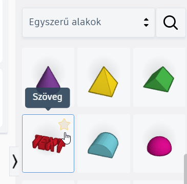
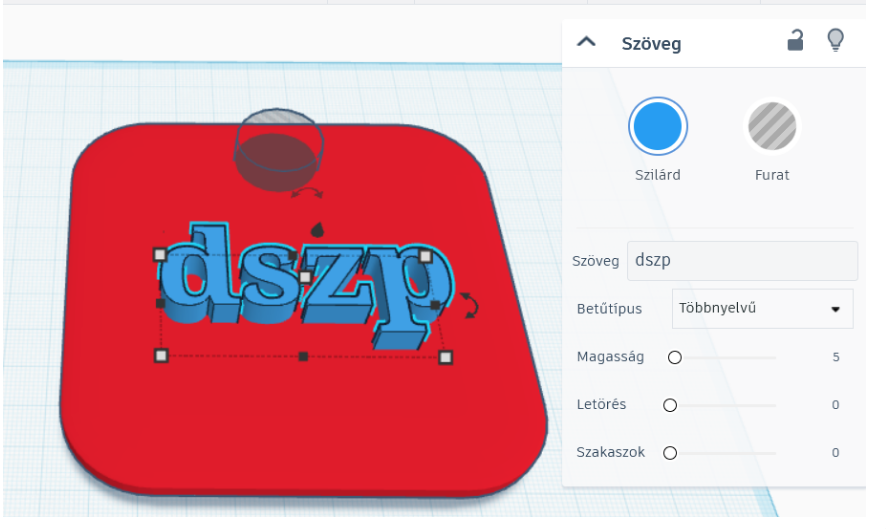
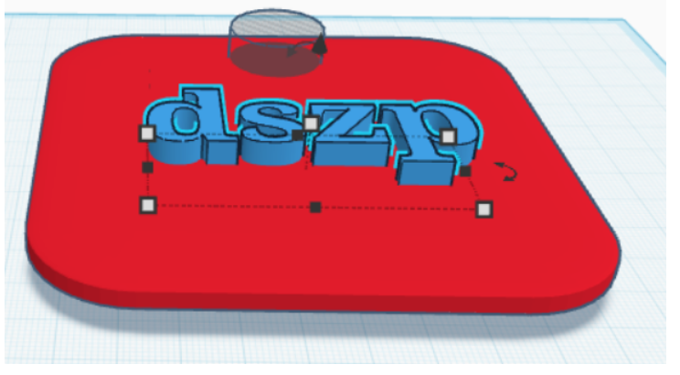
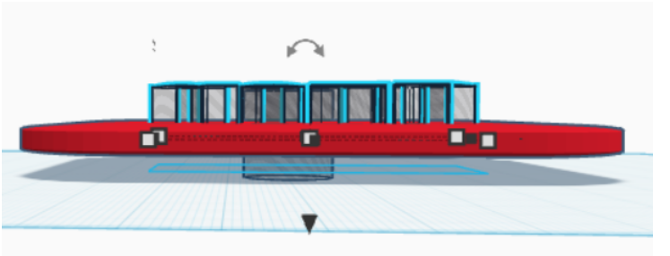
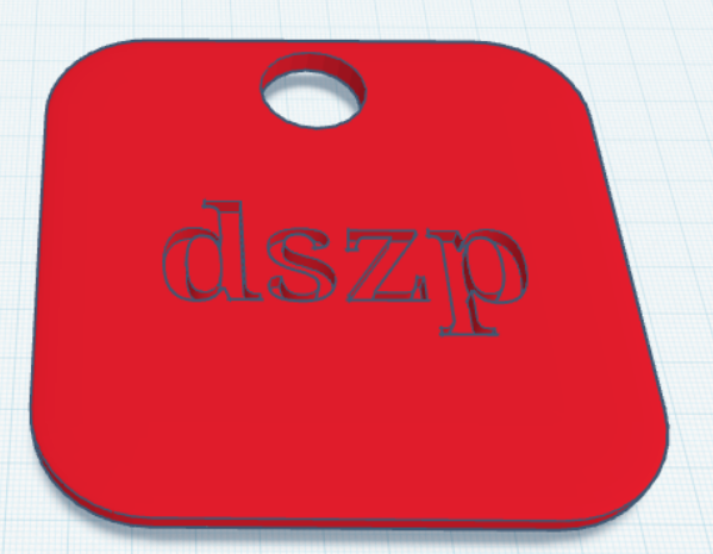
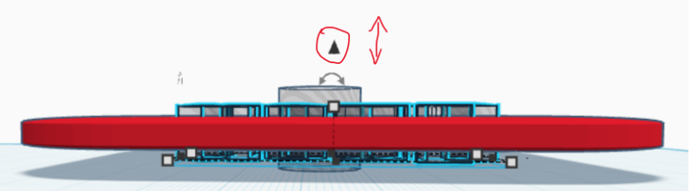
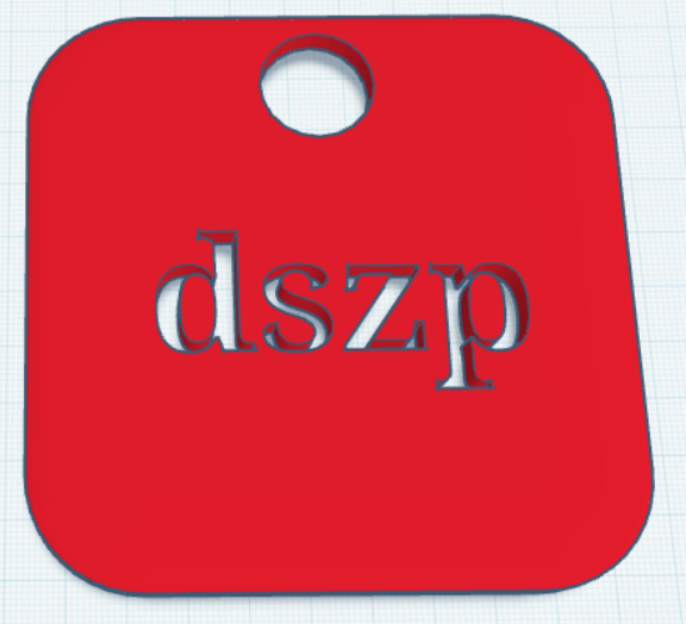

# 🔤 Szöveg és felirat

  

    TINKERCAD · FELIRAT
    <h2>Adj nevet, jelölést vagy üzenetet a modeledhez!</h2>
    
A Tinkercadben a szöveg is egy alakzat. Elhelyezheted önálló elemként, ráemelheted egy tárgy felületére, vagy furatként használva bele is vághatod a modellbe.

  

  
🔤

  ⏱️ 4–6 perc
  🎯 Felirat készítése
  🧩 Csoportosítással kombinálható

## 1. Helyezd el a Szöveg alakzatot!

A jobb oldali alakzatok között keresd meg a **Szöveg / Text** elemet, majd húzd a munkasíkra!

<figure class="tool-figure tool-figure--medium">
  
  <figcaption>A feliratot a <strong>Szöveg / Text</strong> alakzatból készítheted el.</figcaption>
</figure>

## 2. Írd be és állítsd be a szöveget!

A kijelölt szöveg beállítópaneljén írd be a kívánt feliratot! Itt a szöveg megjelenését is módosíthatod, majd a kész alakzatot ugyanúgy **méretezheted, forgathatod és mozgathatod**, mint más Tinkercad-elemeket.

<figure class="tool-figure tool-figure--wide">
  
  <figcaption>Írd be a feliratot, majd állítsd be a méretét és helyzetét a modellen.</figcaption>
</figure>

!!! tip "Előbb a szöveget, utána a pontos méretet!"
    Ha a felirat szövegét később megváltoztatod, a szó hossza is megváltozhat. Érdemes előbb véglegesíteni a szöveget, és csak utána pontosan méretezni és elhelyezni.

## Három gyakori megoldás

### Domború felirat

Ha azt szeretnéd, hogy a felirat **kiemelkedjen a tárgy felületéből**, hagyd a szöveget szilárd testként, helyezd a megfelelő magasságba, majd illeszd a tárgyhoz!

<figure class="tool-figure tool-figure--wide">
  
  <figcaption>A szöveg egy része a tárgy fölé emelkedik, így csoportosítás után domború feliratot kapsz.</figcaption>
</figure>

  <strong>Figyelj a magasságra!</strong>
  A szövegnek érintkeznie kell az alaptesttel, különben a két elem nem alkot valóban összefüggő modellt. Több nézetből ellenőrizd az elhelyezést!

### Bevésett felirat

Ha a betűket **bele szeretnéd süllyeszteni** a tárgy felszínébe, állítsd a szöveget **Furat / Hole** típusúra! Ezután helyezd úgy az alaptestbe, hogy csak annyira mélyüljön bele, amennyire a bevésést szeretnéd, majd csoportosítsd őket!

<figure class="tool-figure tool-figure--wide">
  
  <figcaption>A furatként beállított szöveget csak részben süllyeszd az alaptestbe.</figcaption>
</figure>

<figure class="tool-figure tool-figure--wide">
  
  <figcaption>Csoportosítás után a betűk bemélyedésként jelennek meg a felületen.</figcaption>
</figure>

### Kivágott felirat

Ha a szövegnek **teljesen át kell vágnia** az alaptesten, a furatként beállított betűket vezesd át a tárgy teljes vastagságán! Csoportosítás után a betűk helyén valódi nyílások maradnak.

<figure class="tool-figure tool-figure--wide">
  
  <figcaption>A szöveg furata érje át az alaptest teljes vastagságát.</figcaption>
</figure>

<figure class="tool-figure tool-figure--wide">
  
  <figcaption>A csoportosítás után a betűk teljesen kivágódnak az alaptestből.</figcaption>
</figure>

## Melyiket válaszd?

  
⬆️<strong>Domború</strong>Ha a feliratnak ki kell emelkednie a felületből.

  
🔽<strong>Bevésett</strong>Ha a felirat csak bemélyedjen a tárgy felszínébe.

  
✂️<strong>Kivágott</strong>Ha a betűk helyén teljes nyílást szeretnél.

!!! warning "A vékony betűk 3D nyomtatásnál problémásak lehetnek"
    Ami a képernyőn jól olvasható, nyomtatásban lehet túl vékony vagy törékeny. Kisméretű feliratnál különösen figyelj a betűk vastagságára és arra, hogy a részletek nyomtathatók maradjanak!

## Gyors ellenőrzés

  <label><input type="checkbox">A végleges szöveget írtam be, mielőtt pontosan méreteztem.</label>
  <label><input type="checkbox">A felirat mérete és helyzete megfelel a saját modellemnek.</label>
  <label><input type="checkbox">Domború feliratnál a szöveg valóban érintkezik az alaptesttel.</label>
  <label><input type="checkbox">Bevésett vagy kivágott feliratnál a szöveget Furat típusúra állítottam.</label>
  <label><input type="checkbox">Csoportosítás előtt több nézetből is ellenőriztem a mélységet.</label>

## Kapcsolódó segítség

  <a href="../meretezes/">
    📏
    <strong>Méretezés és igazítás</strong><small>Ha a feliratot pontosan szeretnéd méretezni és elhelyezni.</small>
  </a>
  <a href="../csoportositas/">
    🧩
    <strong>Csoportosítás és szétbontás</strong><small>Ha a feliratot össze szeretnéd kapcsolni az alaptesttel.</small>
  </a>
  <a href="../furat/">
    🕳️
    <strong>Furat készítése</strong><small>Ha a bevésés és kivágás működését szeretnéd jobban megérteni.</small>
  </a>

<a href="../">← Vissza a Tinkercad eszköztárhoz</a>

