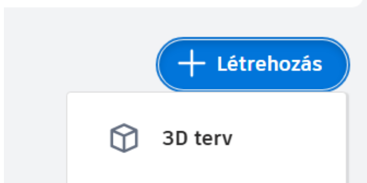
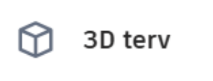
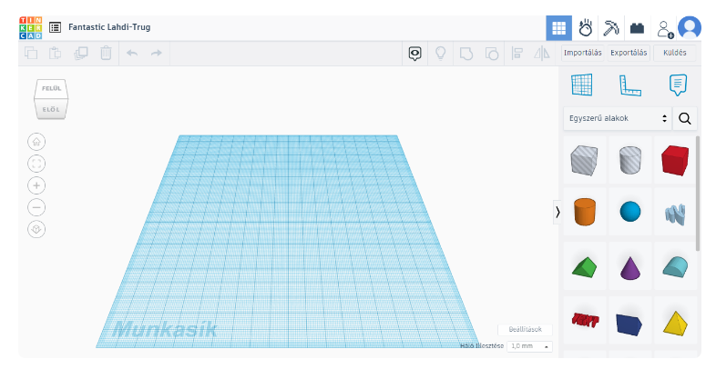
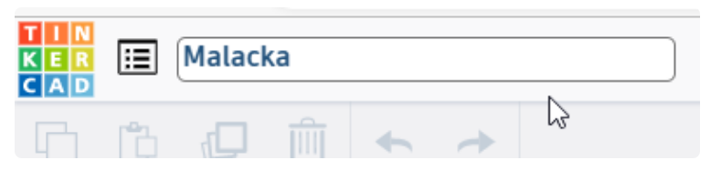
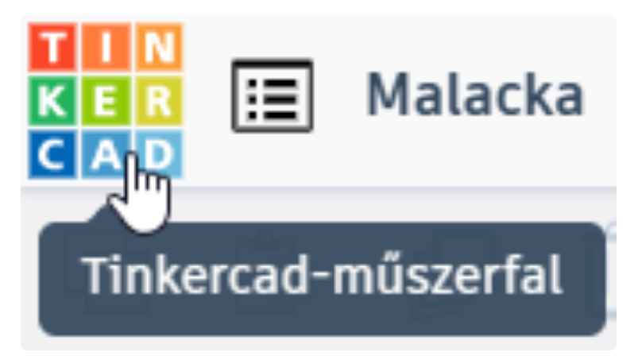

# 🆕 Új 3D terv létrehozása

  

    TINKERCAD · KEZDÉS
    <h2>Indíts új 3D tervet!</h2>
    
Új modell készítéséhez először létre kell hoznod egy <strong>3D tervet</strong>. Ezután nevezd át úgy, hogy később is könnyen felismerd!

  

  
🆕

  👀 kezdőknek
  ⏱️ 3–5 perc
  🧱 új projekt

  <strong>Mire jó?</strong>
  Itt kezdődik minden új Tinkercad-modell: létrehozod a tervet, felismerhető nevet adsz neki, majd később ugyaninnen tudsz visszatérni a saját munkáidhoz.

## Lépésről lépésre

  
1
<strong>Kattints a Létrehozás gombra!</strong>A Tinkercad újabb felületén az új projekt indításához a <strong>Létrehozás</strong> gombot keresd.

<figure class="tool-figure tool-figure--medium">
  
  <figcaption>Kattints a <strong>Létrehozás</strong> gombra!</figcaption>
</figure>

  
2
<strong>Válaszd a 3D terv lehetőséget!</strong>A Tinkercad többféle projektet is tud kezelni. Most 3D modellt készítünk, ezért a <strong>3D terv</strong> kell.

<figure class="tool-figure tool-figure--medium">
  
  <figcaption>Válaszd a <strong>3D terv</strong> lehetőséget!</figcaption>
</figure>

  
3
<strong>Megnyílik a 3D tervezőfelület.</strong>Középen a munkasíkot látod, mellette az alakzatokat és a szerkesztéshez szükséges eszközöket.

<figure class="tool-figure tool-figure--wide">
  
  <figcaption>Az új 3D terv üres munkaterülete. A felület részeit a következő segítségekben használjuk majd.</figcaption>
</figure>

  
4
<strong>Nevezd át a projektet!</strong>A Tinkercad automatikusan ad egy nevet. Kattints rá, és írj helyette olyat, amelyből később is felismered a munkádat!

<figure class="tool-figure tool-figure--medium">
  
  <figcaption>Adj rövid, felismerhető nevet a tervednek!</figcaption>
</figure>

!!! tip "Jó projektnév"
    Olyan nevet válassz, amelyből később is tudod, melyik munkáról van szó. Az automatikusan kapott fantázianév helyett jobb például: **telefontarto**, **kulcstarto** vagy **elso_3d_tervem**.

  
5
<strong>Térj vissza a műszerfalra!</strong>Ha a saját terveidhez szeretnél visszamenni, kattints a bal felső sarokban a Tinkercad ikonjára!

<figure class="tool-figure tool-figure--medium">
  
  <figcaption>A Tinkercad ikonjával visszatérhetsz a műszerfalra és a saját terveidhez.</figcaption>
</figure>

## Mi történik a terveddel?

  
💾<strong>Mentés</strong>Bejelentkezve a Tinkercad automatikusan menti a változtatásaidat.

  
🤝<strong>Megosztás</strong>A tervet később másokkal is megoszthatod, ha közösen szeretnétek dolgozni.

  
📤<strong>Exportálás</strong>A kész modellt fájlba is mentheted, például 3D nyomtatáshoz.

  <strong>Nem kell külön Mentés gombot keresned.</strong>
  Munka közben hagyj egy kis időt a szinkronizálásra, és csak utána zárd be az oldalt vagy jelentkezz ki.

## Gyors ellenőrzés

  <label><input type="checkbox">A <strong>Létrehozás</strong> gombbal új projektet indítottam.</label>
  <label><input type="checkbox">A <strong>3D terv</strong> lehetőséget választottam.</label>
  <label><input type="checkbox">Felismerhető nevet adtam a projektemnek.</label>
  <label><input type="checkbox">Vissza tudok térni a műszerfalra, és újra meg tudom nyitni a tervemet.</label>

!!! note "A jelölések nem mentődnek"
    A pipák csak ezen az oldalon látszanak. Az oldal bezárása után nem maradnak meg.

## Kapcsolódó segítség

  <a href="../bejelentkezes/">
    🔐
    <strong>Bejelentkezés és csatlakozás</strong><small>Ha még nem jutottál be a Tinkercad felületére.</small>
  </a>
  <a href="../navigacio/">
    🧭
    <strong>Navigáció</strong><small>Ha meg szeretnéd tanulni a munkaterület mozgatását és forgatását.</small>
  </a>

<a href="../">← Vissza a Tinkercad eszköztárhoz</a>

