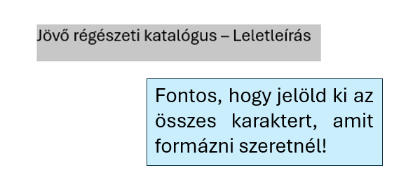
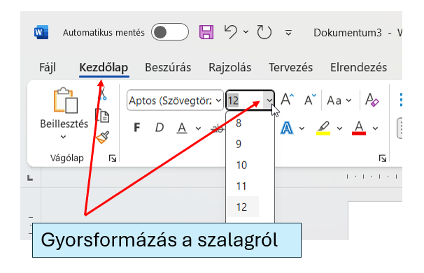
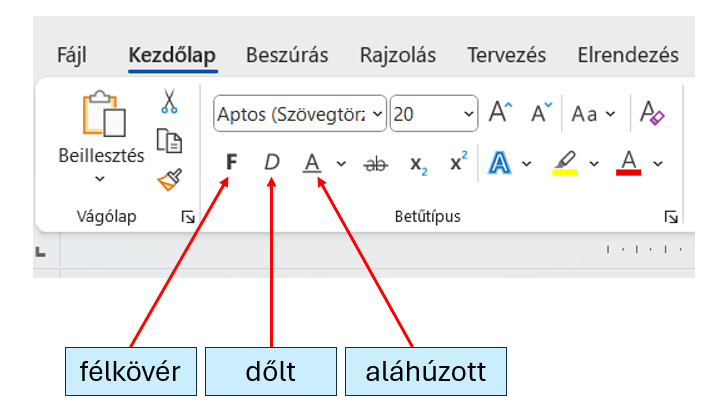

# 🔠 Betűméret és betűstílus

  WORD · SZÖVEGFORMÁZÁS
  <h2>Előbb jelöld ki, utána formázd!</h2>
  
A betűméret, a félkövér, a dőlt és az aláhúzott formázás a <strong>Kezdőlap</strong> szalag <strong>Betűtípus</strong> csoportjában érhető el.

  <h2>⚠️ A legfontosabb lépés</h2>
  
<strong>Jelöld ki az összes karaktert, amelyet formázni szeretnél!</strong> Ha nincs megfelelő kijelölés, könnyen csak a következőként begépelt szöveg formázása változik meg.

<figure class="tool-figure">
  
  <figcaption>Formázás előtt jelöld ki pontosan azt a szövegrészt, amelyet módosítani szeretnél.</figcaption>
</figure>

## Betűméret módosítása

<figure class="tool-figure">
  
  <figcaption>A betűméretet a Kezdőlap → Betűtípus csoportban állíthatod be.</figcaption>
</figure>

  
1
<strong>Jelöld ki a szöveget!</strong>Csak az a rész változzon meg, amelyet valóban formázni szeretnél.

  
2
<strong>Keresd meg a Kezdőlap → Betűtípus csoportot!</strong>A betűméret mezőben számot látsz, például 12 vagy 20.

  
3
<strong>Válassz vagy írj be megfelelő méretet!</strong>A feladatban megadott méretet használd; ne csak szemre állítsd be.

## Félkövér, dőlt, aláhúzott

<figure class="tool-figure">
  
  <figcaption>Ugyanebben a csoportban találod a félkövér, dőlt és aláhúzott formázást is.</figcaption>
</figure>

  
𝗕<strong>Félkövér</strong>Kiemeléshez és címekhez gyakori.

  
𝘐<strong>Dőlt</strong>Más jellegű kiemeléshez használható.

  
U̲<strong>Aláhúzott</strong>Csak akkor használd, ha a feladat vagy a minta indokolja.

<strong>Gyors ellenőrzés</strong>Formázás után kattints a szövegen kívülre, és nézd meg, tényleg csak a kívánt rész változott-e meg!

<a href="../">← Vissza a Word eszköztárhoz</a>

