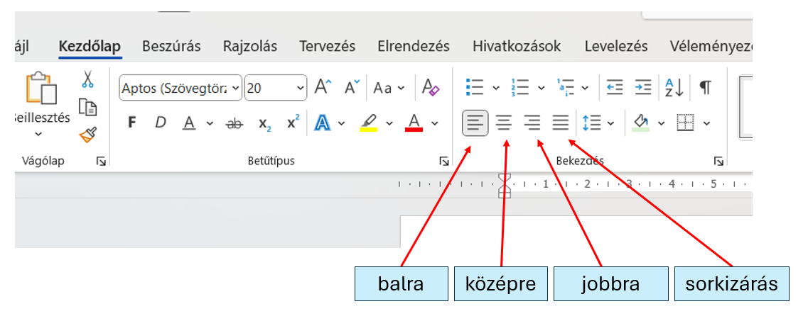

# ↔️ Bekezdés igazítása

  WORD · BEKEZDÉS
  <h2>Balra, középre, jobbra vagy sorkizártan?</h2>
  
Az igazítás azt szabályozza, hogyan helyezkedik el a bekezdés a margók között.

  <h2>💡 Jó hír</h2>
  
Igazításnál általában <strong>elég abban a bekezdésben állnod</strong>, amelyet módosítani szeretnél. Nem szükséges az egész bekezdést kijelölni.

## Hol találod?

A <strong>Kezdőlap</strong> szalag <strong>Bekezdés</strong> csoportjában közvetlenül elérhetők az igazítási gombok.

<figure class="tool-figure">
  
  <figcaption>Az igazítási gombokat a Kezdőlap → Bekezdés csoportban találod.</figcaption>
</figure>

  
⇤<strong>Balra igazítás</strong>A szöveg bal széle rendezett.

  
↔<strong>Középre igazítás</strong>Címeknél gyakran használjuk.

  
⇥<strong>Jobbra igazítás</strong>A szöveg jobb széle rendezett.

  
☰<strong>Sorkizárás</strong>A sorok bal és jobb széle is rendezett.

  
1
<strong>Kattints a módosítandó bekezdésbe!</strong>

  
2
<strong>Kezdőlap → Bekezdés</strong>Válaszd ki a kívánt igazítást!

  
3
<strong>Ellenőrizd a mintát vagy a feladatot!</strong>Ne azt válaszd, amelyik „szebben néz ki”, hanem amelyiket a feladat kér.

<strong>Másik út</strong>Az igazítás a Bekezdés párbeszédablakból is elérhető, de a legtöbb feladatnál a szalag gombjai gyorsabbak.

<a href="../">← Vissza a Word eszköztárhoz</a>

