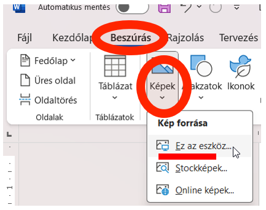

# 🖼️ Kép beszúrása

  WORD · KÉPEK
  <h2>Mentett fájlból vagy vágólapról</h2>
  
Képet többféleképpen is beilleszthetsz a dokumentumba. A feladathoz legkényelmesebb módszert válaszd!

## Kép beszúrása mentett fájlból

<figure class="tool-figure" markdown>
{ loading=lazy }
<figcaption>A Beszúrás → Képek paranccsal választhatsz a gépre mentett képfájlok közül.</figcaption>
</figure>

  
1
<strong>Kattints oda, ahová a képet szeretnéd!</strong>

  
2
<strong>Beszúrás → Képek</strong>Válaszd ki a gépre mentett képfájlt!

  
3
<strong>Kattints a Beszúrás gombra!</strong>

## Kép beszúrása vágólapról

Ha egy képet már a vágólapra másoltál, a Wordben a <strong>Ctrl + V</strong> billentyűkombinációval beillesztheted.

  <h2>⚠️ Fontos</h2>
  
A kép beillesztése és a kép elrendezése két külön lépés. Ha a kép nem mozgatható szabadon, az elrendezést kell megváltoztatnod.

<a href="../">← Vissza a Word eszköztárhoz</a>

