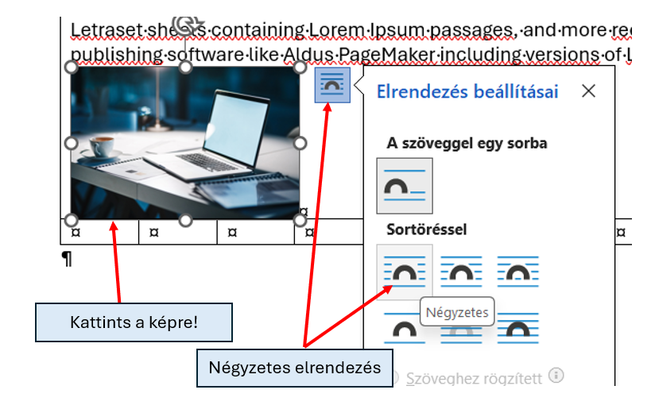
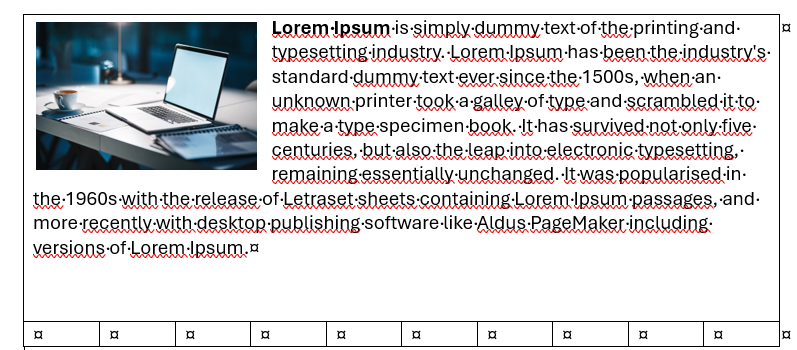

# 🧩 Kép elrendezése

  WORD · KÉPEK
  <h2>Ha a kép nem mozgatható, az elrendezést kell megváltoztatnod</h2>
  
Alapból a Word a képet gyakran úgy kezeli, mintha egy nagy karakter lenne a szöveg sorában. Az elrendezés módosításával szabadabban mozgathatod.

## Hol állítod be?

<figure class="tool-figure" markdown>
{ loading=lazy }
<figcaption>Kattints a képre, majd nyisd meg az elrendezési beállításokat.</figcaption>
</figure>

## Gyors megoldás

  
1
<strong>Kattints a képre!</strong>

  
2
<strong>Nyisd meg az Elrendezési beállításokat!</strong>Válassz olyan körbefuttatást, amely engedi a kép mozgatását.

  
3
<strong>Húzd a képet a megfelelő helyre!</strong>Ellenőrizd, hogy a szöveg továbbra is jól olvasható marad-e.

<figure class="tool-figure" markdown>
{ loading=lazy }
<figcaption>Megfelelő körbefuttatás után a kép már szabadabban elhelyezhető a dokumentumban.</figcaption>
</figure>

<strong>Nem mindig ugyanaz a jó beállítás.</strong>Ha a feladat mintát ad, ahhoz igazodj. Ha nincs minta, olyan elrendezést válassz, amely áttekinthető marad.

<a href="../">← Vissza a Word eszköztárhoz</a>

