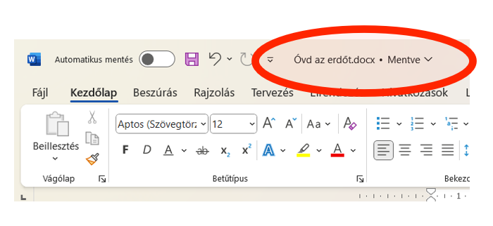

# 💾 Dokumentum mentése

  WORD · DOKUMENTUMKEZELÉS
  <h2>Mentsd el úgy, hogy később biztosan megtaláld!</h2>
  
Az első mentésnél két döntést kell meghoznod: <strong>hová</strong> mented a fájlt, és <strong>mi lesz a neve</strong>.

## Első mentés

<figure class="tool-figure">
  
  <figcaption>Az első mentésnél válaszd ki a helyet és adj kifejező fájlnevet.</figcaption>
</figure>

  
1
<strong>Válassz megfelelő mappát!</strong>Olyan helyre ments, ahol később is biztosan megtalálod a munkádat.

  
2
<strong>Adj kifejező fájlnevet!</strong>A névből derüljön ki, mi van a dokumentumban. Ne maradjon „Dokumentum1”.

  
3
<strong>Ments a Word alapértelmezett formátumában!</strong>Ha a feladat nem kér mást, maradhat a Word dokumentumformátuma.

<strong>A H5P-anyag fő szabálya:</strong>„Munkánkat mentsük egy kifejező néven … Készíts egy mappát a gépeden, ahol biztosan meg fogod találni a munkádat!”

## Későbbi mentés

Ha már egyszer elmentetted a fájlt, a további módosításokat rendszeresen mentsd el. Így egy váratlan program- vagy géphiba esetén kevesebb munkát veszíthetsz el.

  <label><input type="checkbox">Tudom, melyik mappába mentettem.</label>
  <label><input type="checkbox">A fájl neve alapján felismerhető a munkám.</label>
  <label><input type="checkbox">Mentés után folytatom a saját feladatomat.</label>

<a href="../">← Vissza a Word eszköztárhoz</a>

