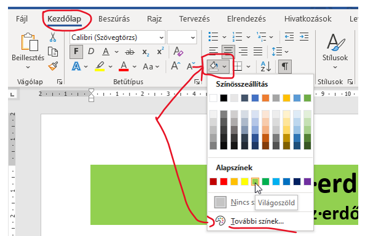

# 🎨 Mintázat – háttérszín a bekezdés mögött

  WORD · BEKEZDÉSFORMÁZÁS
  <h2>Nem a betű színét változtatod meg</h2>
  
A mintázat a <strong>bekezdés hátterét</strong> színezi. Címek és kiemelt blokkok készítésénél gyakran használjuk.

  <h2>⚠️ Ne keverd össze!</h2>
  
A <strong>betűszín</strong> a karaktereket színezi át. A <strong>mintázat</strong> színes hátteret tesz a bekezdés mögé.

## Gyors megoldás

<figure class="tool-figure">
  
  <figcaption>A mintázat színét a Kezdőlap → Bekezdés csoportban állíthatod be.</figcaption>
</figure>

  
1
<strong>Kattints a formázandó bekezdésbe!</strong>Ha több bekezdést szeretnél egyszerre módosítani, jelöld ki őket.

  
2
<strong>Keresd meg a Kezdőlap → Bekezdés csoportot!</strong>

  
3
<strong>Nyisd meg a Mintázat színválasztóját!</strong>Válaszd ki a feladatban vagy a mintán megadott színt.

<strong>Ha pontos szín kell</strong>A „További színek…” lehetőséggel több árnyalat közül választhatsz. Ha a feladat csak közelítő színt kér, nem kell túl sok időt tölteni a kereséssel.

## Ellenőrzés

Nézd meg, hogy valóban a teljes kívánt bekezdés mögött jelent-e meg a háttérszín, és nem csak a karakterek színe változott meg.

<a href="../">← Vissza a Word eszköztárhoz</a>

