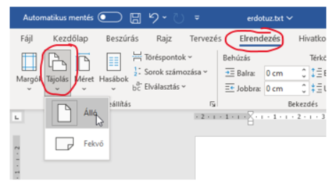
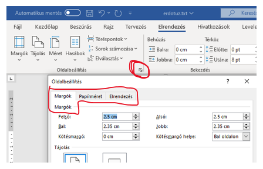
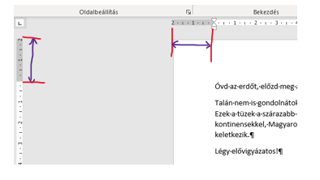
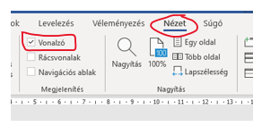

# 📄 Oldalbeállítás

  WORD · OLDAL
  <h2>Tájolás, margó és vonalzó egy helyen</h2>
  
Ha a feladat pontos oldalméretet vagy margót kér, ezeket ne szemre állítsd be!

## Tájolás

<figure class="tool-figure">

<figcaption>Az Elrendezés → Tájolás menüben választhatsz álló vagy fekvő oldalt.</figcaption>
</figure>

  
1
<strong>Nyisd meg az Elrendezés menüt!</strong>

  
2
<strong>Válaszd a Tájolás lehetőséget!</strong>Álló vagy fekvő tájolást választhatsz.

<strong>Alapeset</strong>A Word új dokumentuma általában álló tájolású. Csak akkor változtasd meg, ha a feladat ezt kéri.

## Margók és oldalméret

<figure class="tool-figure">

<figcaption>A részletes oldalbeállításban a margókat, a tájolást és más oldaljellemzőket is pontosan megadhatod.</figcaption>
</figure>

  
1
<strong>Elrendezés → Margók</strong>Választhatsz kész beállítást vagy megadhatsz egyedi margókat.

  
2
<strong>Ellenőrizd az oldalméretet is!</strong>Ha a feladat külön méretet kér, az Elrendezés → Méret menüben állíthatod be.

## Vonalzó

A margókat a vonalzón is ellenőrizheted.

<figure class="tool-figure">

<figcaption>A vonalzó segít megkülönböztetni az oldal margóját és a bekezdés behúzását.</figcaption>
</figure>

Ha a vonalzó nem látszik, kapcsold be a <strong>Nézet → Vonalzó</strong> lehetőséggel.

<figure class="tool-figure">

<figcaption>A Nézet menüben kapcsolhatod be a Vonalzó megjelenítését.</figcaption>
</figure>

  <h2>⚠️ Ne keverd össze!</h2>
  
A margó az oldal szélétől mért üres terület. Nem ugyanaz, mint a bekezdés behúzása.

<a href="../">← Vissza a Word eszköztárhoz</a>

