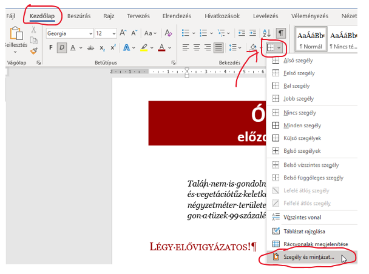
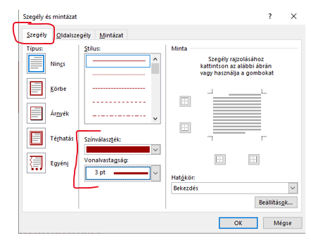

# ▭ Szegély a bekezdéshez

  WORD · BEKEZDÉSFORMÁZÁS
  <h2>Nem mindig kell teljes keret</h2>
  
A Wordben külön beállíthatod, hogy a bekezdés melyik oldalán jelenjen meg szegély: felül, alul, balra, jobbra vagy több oldalon egyszerre.

## Gyors megoldás

<figure class="tool-figure" markdown>
{ loading=lazy }
<figcaption>A Szegély gomb menüjéből választhatod ki, melyik oldalon jelenjen meg vonal.</figcaption>
</figure>

  
1
<strong>Kattints a formázandó bekezdésbe!</strong>

  
2
<strong>Kezdőlap → Bekezdés → Szegély</strong>Nyisd le a szegély gomb melletti menüt!

  
3
<strong>Válaszd ki, melyik oldalon legyen vonal!</strong>Például csak felső és alsó szegély is készíthető.

  <h2>🔧 Ha pontosabb beállítás kell</h2>
  
A <strong>Szegély és mintázat…</strong> ablakban megadhatod a vonal stílusát, színét és vastagságát is.

<figure class="tool-figure" markdown>
{ loading=lazy }
<figcaption>A részletes ablakban a vonal stílusa, színe és vastagsága is módosítható.</figcaption>
</figure>

## Szegély és szöveg közti távolság

Ha a vonal túl közel van a szöveghez, a részletes beállításokban módosítható a szegély és a tartalom közötti távolság. Erre csak akkor van szükség, ha a feladat vagy a minta ezt indokolja.

<strong>Gyakori hiba</strong>Ne automatikusan a „Minden szegély” lehetőséget válaszd! Előbb nézd meg, pontosan milyen vonalakat kér a minta.

<a href="../">← Vissza a Word eszköztárhoz</a>

