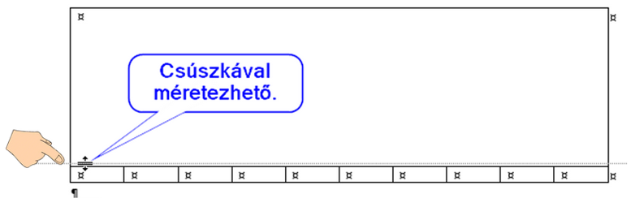

# 📐 Táblázat méretezése

  WORD · TÁBLÁZATOK
  <h2>Oszlopszélesség és sormagasság pontosan</h2>
  
A táblázat sorainak magassága és oszlopainak szélessége is módosítható.

  

    🎬
    

      <strong class="tool-video__title">Nézd meg a műveletet!</strong>
      <strong>Mit figyelj?</strong> A sorok magasságát és az oszlopok szélességét húzással és pontos számértékkel is beállíthatod.
    

  

  <video controls preload="metadata" src="../../../images/eszkoztar/word/03-tablazat-meretezes.mp4"></video>

## Pontos méret megadása

<figure class="tool-figure" markdown>
{ loading=lazy }
<figcaption>A Táblázatelrendezés szalagon számszerűen is megadhatod a sormagasságot és az oszlopszélességet.</figcaption>
</figure>

  
1
<strong>Jelöld ki a módosítandó cellákat, sort vagy oszlopot!</strong>

  
2
<strong>Nyisd meg a Táblázatelrendezés szalagot!</strong>

  
3
<strong>Add meg a kívánt magasságot vagy szélességet!</strong>Ha a feladat pontos méretet kér, számot írj be, ne szemre állítsd.

## Gyors méretezés

Az oszlop- és sorhatárokat az egérrel is húzhatod. Ez akkor jó, ha nincs előírt pontos méret.

<strong>Vonalzó</strong>Bizonyos méretezéseket a vonalzón is elvégezhetsz, de pontos feladatnál a számszerű beállítás biztosabb.

  <h2>⚠️ Mire figyelj?</h2>
  
Ha több cellát jelölsz ki, a módosítás mindegyikre vonatkozhat. Ellenőrizd a kijelölést, mielőtt méretezel!

<a href="../">← Vissza a Word eszköztárhoz</a>

